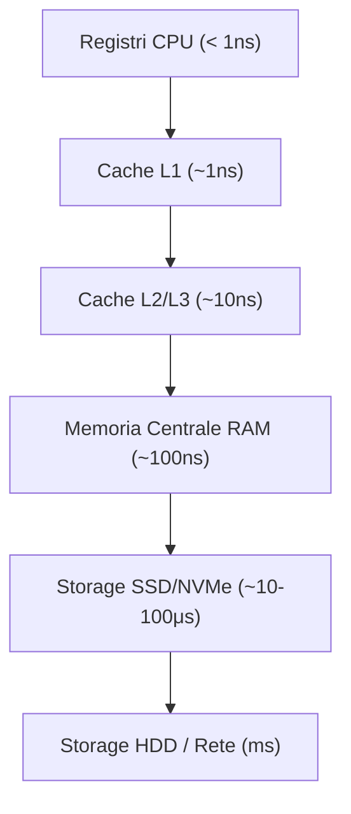

# Algoritmi, Strutture Dati e Sistemi Operativi
*(Focus per il concorso Esperto ICT - Banca d'Italia)*

Prima di progettare architetture distribuite o pipeline di dati, un candidato deve padroneggiare le fondamenta computazionali: come si valuta l'efficienza di un algoritmo, quali strutture dati scegliere, e come un sistema operativo gestisce processi, memoria e concorrenza. Sono i temi con il maggior peso per il **Profilo A** (sistemista/sviluppo) e per il **Profilo C** (interventi diagnostici sui sistemi); anche per il **Profilo B** restano il presupposto per capire come le policy di sicurezza si applicano a livello di sistema operativo (es. isolamento dei processi, gestione della memoria come superficie di attacco).

---

## 1. Algoritmi, Strutture Dati e Complessità

### 1.1 Notazione O-grande (Big-O)
Misura come il tempo di esecuzione (o lo spazio in memoria) di un algoritmo cresce all'aumentare della dimensione `n` dell'input, indipendentemente dall'hardware.
* **O(1)** costante, **O(log n)** logaritmica (es. ricerca binaria), **O(n)** lineare, **O(n log n)** (es. merge sort, quick sort medio), **O(n²)** quadratica (es. bubble sort), **O(2ⁿ)** esponenziale.
* Si valuta sempre il **caso peggiore (worst case)**, salvo diversa indicazione (caso medio/migliore).

### 1.2 Strutture Dati Fondamentali
* **Array:** accesso O(1) per indice, inserimento/rimozione O(n) (richiede shift degli elementi).
* **Lista collegata (Linked List):** inserimento/rimozione O(1) se si ha il riferimento al nodo, accesso O(n) (nessun accesso diretto per indice).
* **Stack (LIFO)** e **Coda (FIFO):** operazioni push/pop o enqueue/dequeue in O(1).
* **Alberi binari di ricerca (BST):** ogni nodo ha al più due figli; il sottoalbero sinistro contiene valori minori, quello destro valori maggiori. Ricerca, inserimento e cancellazione in **O(log n)** se l'albero è bilanciato, ma degradano a **O(n)** nel caso patologico (albero sbilanciato, es. inserimento di dati già ordinati). Alberi auto-bilancianti (AVL, Red-Black) garantiscono O(log n) anche nel caso peggiore.

### 1.3 Algoritmi di Ordinamento
| Algoritmo | Complessità (medio) | Note |
|---|---|---|
| Bubble/Selection Sort | O(n²) | Semplici ma inefficienti su grandi dataset |
| Merge Sort | O(n log n) | Stabile, divide-et-impera, richiede memoria ausiliaria O(n) |
| Quick Sort | O(n log n) medio, O(n²) worst case | In-place, worst case su input già ordinati con scelta ingenua del pivot |

### 1.4 Algoritmi su Grafi
* **BFS (Breadth-First Search):** esplorazione per livelli, usa una coda; trova il cammino minimo in grafi non pesati.
* **DFS (Depth-First Search):** esplorazione in profondità, usa uno stack (o ricorsione); utile per rilevare cicli o componenti connesse.
* **Dijkstra:** cammino minimo in grafi con pesi non negativi.

### 1.5 Classi di Complessità
* **P:** problemi risolvibili in tempo polinomiale da un computer deterministico.
* **NP:** problemi la cui soluzione, una volta trovata, è verificabile in tempo polinomiale (ma non necessariamente trovabile in tempo polinomiale).
* **NP-completo:** i problemi "più difficili" della classe NP; se anche uno solo fosse risolvibile in tempo polinomiale, allora P = NP (uno dei problemi aperti più importanti dell'informatica).

### 1.6 Hashing e Tabelle Hash
Una funzione hash mappa una chiave di dimensione arbitraria in un indice di dimensione fissa, permettendo inserimento/ricerca in **O(1) medio**. Le **collisioni** (due chiavi che generano lo stesso indice) si gestiscono con tecniche come il *chaining* (lista collegata per bucket) o l'*open addressing* (ricerca del prossimo slot libero).

---

## 2. Architettura degli Elaboratori e Sistemi Operativi

### 2.1 Il Modello di von Neumann
L'architettura standard dei calcolatori moderni: un'unica memoria condivisa contiene sia le istruzioni (programma) sia i dati, letti dalla CPU attraverso un bus. La CPU si compone di **ALU** (Unità Aritmetico-Logica), **Control Unit** e **registri**. Il collo di bottiglia strutturale (*von Neumann bottleneck*) è la banda limitata tra CPU e memoria, mitigata dalla gerarchia di cache.

### 2.2 Gerarchia di Memoria e Cache
Dal livello più veloce/costoso/piccolo al più lento/economico/capiente:

Il principio di **località** (temporale: un dato riusato a breve; spaziale: dati vicini in memoria usati insieme) è ciò che rende efficace la cache: si copiano i dati più probabilmente riutilizzati nel livello più veloce.

### 2.3 Processi, Thread e Scheduling
* **Processo:** istanza di un programma in esecuzione, con il proprio spazio di indirizzamento isolato (memoria, file descriptor, stato).
* **Thread:** unità di esecuzione all'interno di un processo; più thread dello stesso processo condividono lo spazio di memoria, rendendo la comunicazione più veloce ma esposta a race condition.
* **Scheduling:** l'algoritmo del sistema operativo che decide quale processo/thread ottiene la CPU e per quanto tempo (es. Round Robin, priorità, multilevel feedback queue), bilanciando throughput, latenza ed equità.

### 2.4 Concorrenza: Race Condition e Deadlock
* **Race Condition:** quando il risultato di un'operazione dipende dall'ordine non deterministico di esecuzione di più thread/processi che accedono a una risorsa condivisa senza sincronizzazione adeguata. Si previene con **mutex**, **semafori** o meccanismi di **locking**.
* **Deadlock:** situazione di stallo permanente in cui due o più processi attendono indefinitamente una risorsa detenuta dall'altro. Si verifica quando sussistono contemporaneamente quattro condizioni (**mutua esclusione, possesso e attesa, non prerilascio, attesa circolare**); prevenzione/rilevamento tipicamente rompe una di queste condizioni.

### 2.5 Gestione della Memoria e Paginazione
* **Memoria virtuale:** astrae la memoria fisica dando a ogni processo l'illusione di uno spazio di indirizzamento continuo e privato, indipendentemente dalla RAM realmente disponibile.
* **Paginazione (Paging):** la memoria virtuale e quella fisica sono divise in blocchi di dimensione fissa (*pagine* e *frame*); una **tabella delle pagine** mappa le une alle altre. Se una pagina richiesta non è in RAM si genera un **page fault** e il sistema operativo la carica dallo storage (swap), eventualmente rimpiazzandone un'altra secondo politiche come **LRU (Least Recently Used)**.

### 2.6 File System
Struttura che organizza i dati persistenti su storage in file e directory, gestendo metadati (permessi, timestamp), allocazione dello spazio su disco e, nei file system giornalati (*journaling*, es. ext4, NTFS), la resilienza a crash improvvisi tramite log delle operazioni pendenti.

### 2.7 Virtualizzazione e Container
* **Virtualizzazione (VM):** un **hypervisor** (Type 1 "bare-metal" come VMware ESXi/KVM, o Type 2 ospitato su un OS host) astrae l'hardware fisico per eseguire più sistemi operativi guest isolati, ciascuno con il proprio kernel.
* **Container (es. Docker):** condividono il **kernel** del sistema operativo host, isolando solo lo spazio utente (processi, file system, rete) tramite meccanismi del kernel Linux come **namespace** (isolamento della visibilità) e **cgroups** (limitazione delle risorse). Sono più leggeri e veloci da avviare rispetto a una VM, a scapito di un isolamento meno forte (kernel condiviso).

---

> [!TIP]
> **Consiglio per l'Esame:**
> Su questi temi la commissione tende a testare la **comprensione del "perché"**, non solo la definizione: es. perché un B-Tree bilanciato è preferibile a un BST semplice per un indice di database (accessi a disco minimizzati), perché i container sono preferiti alle VM in un'architettura a microservizi (densità e velocità di scaling), o come un deadlock nella gestione di lock su un database transazionale possa impattare la disponibilità di un sistema di pagamento critico (collegamento diretto a RTO/DORA, già visto in `ICT_Exam_Topics_Banca_Italia.md`).
