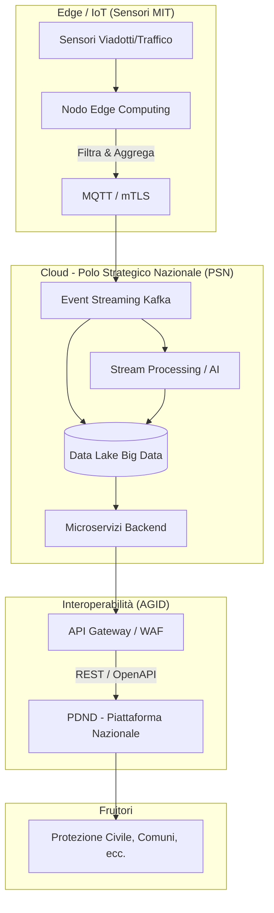

# Simulazione Orale #1: Piattaforma di Monitoraggio Predittivo per Infrastrutture Critiche

## 📝 Traccia dell'Esame
Il Ministero delle Infrastrutture e dei Trasporti deve progettare e rilasciare un nuovo sistema digitale in Cloud per il monitoraggio in tempo reale e predittivo dello stato delle infrastrutture viarie (ponti, viadotti) e del traffico.

Il candidato illustri ad alto livello l'architettura e la metodologia di sviluppo della soluzione affrontando:
1. Interoperabilità e Big Data
2. Cybersecurity (NIS2)
3. Ingegneria del Software (DevOps)

---

## 🏆 La Risposta Ideale (Modello per la Commissione)

### 1. Dati e Interoperabilità (Focus Lazzaretti & AGID)
*   **Ingestione Edge Computing:** Utilizziamo nodi di **Edge Computing** sui viadotti per la pulizia del dato grezzo, riducendo la latenza e il carico di rete. I nodi inviano i dati aggregati al Cloud tramite protocolli leggeri e asincroni (es. MQTT o broker **Apache Kafka**).
*   **Conservazione:** I dati confluiscono in un **Data Lake** governativo ospitato sul PSN (Polo Strategico Nazionale), che permette scalabilità per l'analisi dei Big Data.
*   **Esposizione API (Regola d'oro):** Le API devono aderire al **Modello di Interoperabilità AGID (ModI)** ed essere erogate attraverso la **PDND (Piattaforma Digitale Nazionale Dati)**. Si utilizzeranno API REST documentate con standard **OpenAPI 3.0** e sicure tramite token OAuth 2.0.

### 2. Sicurezza e Compliance NIS2 (Focus Agrifoglio)
*   **Zero Trust Architecture:** Nessun dispositivo o utente è considerato sicuro di default.
*   **Sicurezza in Transito e a Riposo:** La comunicazione tra l'Edge Computing e il Cloud avviene tramite **mTLS (Mutual TLS 1.3)** per garantire che solo i sensori autorizzati possano inviare dati. I dati nel Data Lake sono cifrati (*Encryption at Rest* con AES-256).
*   **Protezione Perimetrale:** Le API verso la PDND sono protette da un **WAF (Web Application Firewall)** e sistemi anti-DDoS per garantire la continuità operativa del servizio essenziale (NIS2).

### 3. Ingegneria del Software (Focus Pinna)
*   **Metodologia e Architettura:** Adozione di un'architettura a **Microservizi** tramite container OCI orchestrati su **Kubernetes**.
*   **CI/CD (Continuous Integration / Continuous Deployment):** I rilasci avvengono tramite pipeline automatizzate:
    *   *Integrazione:* Ogni commit attiva test automatizzati e scansioni di sicurezza statiche del codice (**SAST**).
    *   *Rilascio:* Si utilizza la strategia **Blue/Green Deployment** (nuovo codice avviato in parallelo al vecchio, spostando il traffico solo se gli health-check passano) per evitare interruzioni di servizio.

---

## 📐 Diagramma Architetturale

---

### 💡 Feedback Strategico
* Mai nominare l'esposizione di "API" per la PA senza associarvi immediatamente la **"PDND"** (Piattaforma Digitale Nazionale Dati).
* Coprire sempre tutti gli elementi del bando: se è richiesto di parlare di Ingegneria e Sicurezza, questi punti devono avere pari peso rispetto al design infrastrutturale.
