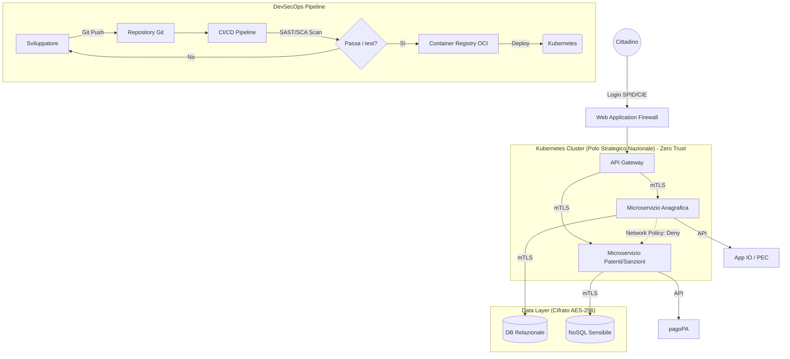

# Simulazione Orale #2: Il Fascicolo Unico dei Trasporti in Cloud (GDPR, CAD, NIS2, DevOps)

## 📝 Traccia dell'Esame
Progettazione architetturale e normativa di un portale critico per il MIT (Fascicolo Unico dei Trasporti) con focus su:
1. Aspetti Normativi (CAD e GDPR)
2. Cloud e DevOps (DevSecOps)
3. Cybersecurity, Crittografia e compliance NIS2

---

## 🏆 La Risposta Ideale (Modello per la Commissione)

### 1. Aspetti Normativi (CAD e GDPR)
La progettazione deve essere guidata dalle normative nazionali ed europee:
*   **Codice dell'Amministrazione Digitale (CAD):** 
    *   **Identità Digitale (Art. 64):** L'accesso dei cittadini al portale avverrà **esclusivamente** tramite SPID (Sistema Pubblico di Identità Digitale), CIE (Carta d'Identità Elettronica) o eIDAS. Non esisteranno credenziali proprietarie (username/password).
    *   **Pagamenti (Art. 5):** Qualsiasi sanzione o bollo sarà gestito nativamente integrando il nodo **pagoPA**.
    *   **Comunicazioni:** L'invio di notifiche ai cittadini avverrà tramite **App IO** e il **Domicilio Digitale** (INAD/PEC).
*   **GDPR (Regolamento UE 2016/679):**
    *   **Privacy by Design & by Default (Art. 25):** I dati saranno raccolti secondo il principio di minimizzazione (solo quelli strettamente necessari). 
    *   **Pseudonimizzazione:** I dati sensibili (es. idoneità medica alla guida) saranno separati dai dati anagrafici e pseudonimizzati nel database. L'accesso a questi dati da parte dei dipendenti del MIT avverrà tramite rigorosi **RBAC (Role-Based Access Control)** tracciati in appositi log di audit inalterabili.

### 2. Cloud Native e DevSecOps
La migrazione e lo sviluppo seguono i paradigmi moderni per garantire scalabilità e affidabilità:
*   **Architettura Cloud Native:** Sviluppo basato sui principi **12-Factor App**. L'applicativo è diviso in **Microservizi** (es. Servizio Patenti, Servizio Multe) pacchettizzati in container (Docker/OCI) e orchestrati tramite **Kubernetes (K8s)** sul Polo Strategico Nazionale (PSN).
*   **DevSecOps (Shift-Left Security):** La sicurezza è integrata nel ciclo di vita del software fin dal primo giorno:
    *   Il codice è gestito su un repository Git. 
    *   La pipeline CI/CD esegue automaticamente test statici di sicurezza (**SAST** per trovare vulnerabilità nel codice) e analisi delle dipendenze (**SCA** per evitare librerie esterne compromesse).
    *   L'infrastruttura viene creata come codice (**Infrastructure as Code - IaC** tramite Terraform), permettendo di replicare ambienti identici e sicuri.

### 3. Cybersecurity, Crittografia e NIS2
L'infrastruttura è considerata "Servizio Essenziale" e adotta una postura difensiva assoluta:
*   **Crittografia:**
    *   *In transito:* Tutto il traffico esterno avviene in HTTPS/TLS 1.3. Il traffico **interno** tra i vari microservizi dentro Kubernetes usa **mTLS (Mutual TLS)** per autenticare entrambi i *peer* (come suggerito!).
    *   *A riposo:* I database e i backup sono cifrati con algoritmo **AES-256**. Le chiavi crittografiche sono ruotate dinamicamente tramite un sistema di Key Management System (KMS) basato su moduli **HSM** (Hardware Security Module).
*   **Architettura Zero Trust:** La rete interna è segmentata (Micro-segmentazione). Un servizio compromesso non può parlare con un altro servizio a meno che non ci sia una *Network Policy* esplicita che lo autorizzi.
*   **Compliance NIS2 (Resilienza):** Per garantire la Business Continuity (e prevenire interruzioni), l'architettura è distribuita su Multi-Availability Zone. È presente un SOC (Security Operations Center) che raccoglie i log tramite un sistema SIEM per rilevare anomalie e gestire gli incidenti informatici entro le 24 ore richieste dalla direttiva.

---

## 📐 Diagramma Architetturale (Cloud & DevSecOps)

