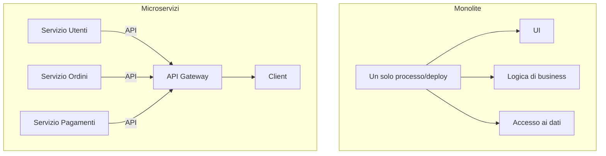
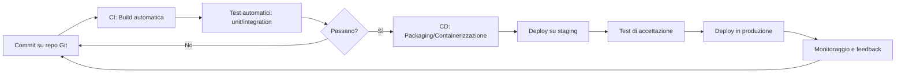

# Materia 1 — Ingegneria del Software, Sviluppo, API/Integrazione, DevOps, Security & Privacy by Design
*Materiale di studio per la prova scritta MIT-EPI (60 quiz/70 min, soglia 21/30)*

---

## 1.1 Ciclo di vita del software (SDLC) e modelli di processo

Il **SDLC (Software Development Life Cycle)** è la sequenza di fasi con cui un sistema informatico viene concepito, costruito e mantenuto: **Raccolta requisiti → Analisi → Progettazione (design) → Sviluppo (coding) → Test → Rilascio (deployment) → Manutenzione**.

| Modello | Caratteristiche | Quando è adatto |
|---|---|---|
| **Waterfall** | Fasi sequenziali e rigide, ogni fase si chiude prima della successiva; documentazione pesante | Requisiti stabili e ben noti fin dall'inizio (es. sistemi safety-critical con approvazioni normative) |
| **Iterativo/Incrementale** | Il sistema viene costruito a incrementi funzionanti successivi | Requisiti parzialmente noti, necessità di rilasci parziali |
| **Agile (Scrum, Kanban)** | Iterazioni brevi (sprint), feedback continuo col committente, adattamento ai cambiamenti | Requisiti in evoluzione, necessità di time-to-market rapido; nella PA è oggi il riferimento anche per la rendicontazione a milestone del PNRR |
| **Scrum in dettaglio** | Ruoli: **Product Owner** (priorità/backlog), **Scrum Master** (facilita il processo, rimuove ostacoli), **Development Team**. Artefatti: **Product Backlog**, **Sprint Backlog**, **Increment**. Cerimonie: Sprint Planning, Daily Stand-up, Sprint Review, Retrospective | Team piccoli/medi, sviluppo iterativo con timebox fisso (sprint di 1-4 settimane) |
| **Kanban** | Flusso continuo visualizzato su board (To Do/In Progress/Done), limiti WIP (Work In Progress) | Flussi di lavoro continui, manutenzione, supporto |

*Sintesi per l'esame*: se la domanda contrappone "rigidità documentale e approvazioni formali" → **Waterfall**; se contrappone "adattabilità e iterazioni brevi" → **Agile**. Se cita ruoli come Product Owner/Scrum Master → è sicuramente **Scrum**.

## 1.2 Analisi e progettazione dei sistemi informatici

* **Requisiti funzionali** (cosa deve fare il sistema) vs **requisiti non funzionali** (come deve farlo: prestazioni, sicurezza, usabilità, scalabilità, manutenibilità — i cosiddetti **"-ilities"**).
* **UML (Unified Modeling Language)**: notazione standard per la progettazione OO. Diagrammi principali:
  * *Strutturali*: diagramma delle classi (attributi, metodi, relazioni: associazione, aggregazione, composizione, ereditarietà).
  * *Comportamentali*: diagramma dei casi d'uso (use case, attori), diagramma di sequenza (interazioni temporali tra oggetti), diagramma di stato.
* **Design pattern** (Gang of Four) — soluzioni riusabili a problemi ricorrenti:
  * *Creazionali*: Singleton (istanza unica), Factory (delega la creazione di oggetti).
  * *Strutturali*: Adapter (adatta interfacce incompatibili), Facade (interfaccia semplificata a un sottosistema complesso).
  * *Comportamentali*: Observer (notifica automatica ai subscriber al cambiare di uno stato), Strategy (algoritmi intercambiabili a runtime).
* **Principi SOLID** per il codice orientato agli oggetti: **S**ingle Responsibility, **O**pen/Closed, **L**iskov Substitution, **I**nterface Segregation, **D**ependency Inversion — riducono l'accoppiamento e aumentano la manutenibilità.

## 1.3 Architetture applicative: monolite, microservizi, pattern MVC

| Aspetto | Monolite | Microservizi |
|---|---|---|
| Deploy | Unico artefatto, tutto insieme | Indipendente per ogni servizio |
| Scalabilità | Verticale (tutta l'app) | Orizzontale e selettiva (solo il servizio sotto carico) |
| Complessità operativa | Bassa (un solo processo da gestire) | Alta (orchestrazione, service discovery, resilienza di rete) |
| Guasti | Un bug può bloccare tutta l'app | Isolamento dei guasti (con pattern come Circuit Breaker) |
| Adatto a | Team piccoli, dominio semplice, fase iniziale di un progetto | Team grandi, dominio complesso, necessità di scalare parti specifiche |

* **Pattern MVC (Model-View-Controller)**: separa i dati (**Model**), la presentazione (**View**) e la logica di controllo/input (**Controller**) — riduce l'accoppiamento tra logica di business e interfaccia utente. Varianti moderne: MVVM (Model-View-ViewModel, tipico di frontend reattivi).
* **SPA (Single Page Application)**: frontend che carica una sola pagina HTML e aggiorna dinamicamente il DOM interrogando API backend (via AJAX/fetch), senza ricaricare l'intera pagina — tipico di framework come React/Angular/Vue.
* **Sviluppo mobile**: **nativo** (Swift/Kotlin, massime prestazioni e accesso hardware, ma doppio sviluppo per iOS/Android) vs **cross-platform** (React Native/Flutter, un solo codebase, minor costo ma compromessi prestazionali) vs **web app/PWA** (Progressive Web App, installabile e offline-capable ma con funzionalità hardware limitate).
* **Accessibilità**: per applicazioni web della PA è obbligatorio il rispetto delle **WCAG 2.1** (Legge Stanca) — percepibilità, utilizzabilità, comprensibilità, robustezza.

## 1.4 API e integrazione di sistemi

| Caratteristica | REST | SOAP |
|---|---|---|
| Paradigma | Architetturale (stile), basato su risorse | Protocollo, basato su messaggi XML rigidi |
| Formato dati | Tipicamente JSON (ma anche XML) | Solo XML (envelope SOAP) |
| Trasporto | HTTP/HTTPS, usa i verbi (GET/POST/PUT/DELETE) semanticamente | Agnostico al trasporto (HTTP, SMTP, ecc.) |
| Contratto | Nessuno rigido (talvolta OpenAPI/Swagger) | **WSDL** (Web Services Description Language) — contratto formale e verificabile |
| Stato | **Stateless** (ogni richiesta è autosufficiente) | Può gestire stato tramite estensioni (WS-*) |
| Overhead | Basso, leggero | Alto (busta XML, header estesi) |
| Sicurezza nativa | Nessuna built-in, si usano HTTPS + OAuth2/JWT | **WS-Security** integrato nello standard |
| Uso tipico oggi | API pubbliche, mobile, microservizi | Sistemi legacy enterprise/PA, integrazioni B2B con requisiti contrattuali rigidi |

* **Principi REST**: identificazione delle risorse via URI, uso dei verbi HTTP con semantica corretta (GET idempotente e sicuro, POST crea, PUT sostituisce/aggiorna idempotente, DELETE rimuove), stateless, rappresentazioni multiple (content negotiation), **HATEOAS** (Hypermedia As The Engine Of Application State — le risposte contengono link alle azioni successive possibili).
* **GraphQL**: alternativa a REST che permette al client di specificare esattamente i dati richiesti in un'unica query, riducendo over-fetching/under-fetching, a costo di maggiore complessità lato server.
* **gRPC**: framework RPC ad alte prestazioni basato su HTTP/2 e Protocol Buffers (binario, non testuale) — usato per comunicazione interna tra microservizi a bassa latenza.
* **Sicurezza delle API**:
  * **Autenticazione**: verifica dell'identità (chi sei) — es. **OAuth 2.0** (delega di autorizzazione tramite token, non trasmette credenziali) + **OIDC** (OpenID Connect, layer di autenticazione sopra OAuth2 che aggiunge l'identità dell'utente tramite ID Token JWT).
  * **Autorizzazione**: verifica dei permessi (cosa puoi fare) — scope OAuth2, RBAC (Role-Based Access Control), ABAC (Attribute-Based).
  * **mTLS (mutual TLS)**: autenticazione bidirezionale server-to-server tramite certificati X.509, tipica delle integrazioni PDND/ModI nella PA italiana.
  * **API Gateway**: punto di ingresso unico che centralizza autenticazione, rate limiting, logging, routing verso i microservizi a monte.
* **Integrazione di sistemi — pattern architetturali**: **ESB (Enterprise Service Bus)** per integrazioni centralizzate legacy; **Message Broker** (RabbitMQ, Kafka) per comunicazione asincrona disaccoppiata tra sistemi tramite code/topic — aumenta la resilienza (un sistema down non blocca gli altri) a costo di maggiore complessità di gestione della coerenza.

## 1.5 DevOps e ciclo di vita CI/CD

* **CI (Continuous Integration)**: pratica di integrare frequentemente (più volte al giorno) le modifiche di codice in un repository condiviso, con build e test automatici a ogni commit — riduce l'"integration hell" causato da merge tardivi e divergenti.
* **CD**: due accezioni distinte, spesso confuse nei quiz:
  * **Continuous Delivery**: il codice è sempre in uno stato "pronto per il rilascio" dopo il superamento dei test, ma il deploy in produzione richiede un'**approvazione manuale**.
  * **Continuous Deployment**: ogni modifica che supera la pipeline viene rilasciata in produzione **automaticamente**, senza intervento umano.
* **IaC (Infrastructure as Code)**: l'infrastruttura (reti, VM, storage) è definita tramite codice dichiarativo versionato, non configurata manualmente. Strumenti: **Terraform** (multi-cloud, dichiarativo), **Ansible** (configuration management, agentless, basato su SSH), **Puppet/Chef** (configuration management con agente). Vantaggi: riproducibilità, versionamento, riduzione dell'errore umano ("configuration drift").
* **Containerizzazione**: **Docker** impacchetta applicazione + dipendenze in immagini immutabili eseguite in container isolati (a livello di processo/OS, non di hardware come le VM) — più leggero e veloce da avviare di una VM.
* **Orchestrazione**: **Kubernetes** gestisce il ciclo di vita di container su larga scala: scheduling automatico su nodi, **auto-scaling** (orizzontale in base al carico), **self-healing** (riavvio automatico di container falliti), **service discovery** e load balancing interno, **rolling update** (aggiornamenti senza downtime).
* **Monitoraggio e osservabilità**: le "tre pillar" sono **log** (eventi discreti), **metriche** (serie temporali numeriche, es. CPU/latenza), **tracing distribuito** (percorso di una richiesta tra più microservizi) — strumenti tipici: Prometheus/Grafana per le metriche, ELK/OpenSearch per i log.

## 1.6 Security & Privacy by Design (DevSecOps)

Principio cardine (anche giuridico, art. 25 GDPR — *Data Protection by Design and by Default*): la sicurezza e la tutela dei dati personali **non sono un layer aggiunto a fine progetto**, ma requisiti incorporati fin dalla fase di analisi/design del sistema.

* **DevSecOps**: estende la pipeline DevOps integrando controlli di sicurezza automatizzati in ogni fase, non solo prima del rilascio:
  * **SAST (Static Application Security Testing)**: analizza il codice sorgente senza eseguirlo, individua pattern vulnerabili (es. SQL injection nel codice) — eseguito già in fase di commit/build.
  * **DAST (Dynamic Application Security Testing)**: testa l'applicazione **in esecuzione** simulando attacchi esterni (black-box) — individua vulnerabilità runtime non visibili staticamente.
  * **SCA (Software Composition Analysis)**: analizza le librerie/dipendenze di terze parti (incluse quelle open source) alla ricerca di vulnerabilità note (CVE) — fondamentale data la pervasività delle supply chain software.
  * **IAST (Interactive AST)**: ibrido, strumenta l'applicazione durante i test funzionali per rilevare vulnerabilità con contesto runtime.
* **Threat Modeling**: attività di analisi dei rischi architetturali **prima** di scrivere codice. Metodologia diffusa: **STRIDE** — **S**poofing (furto d'identità), **T**ampering (manomissione dati), **R**epudiation (negabilità di un'azione), **I**nformation disclosure (divulgazione non autorizzata), **D**enial of Service, **E**levation of privilege.
* **OWASP Top 10**: lista aggiornata periodicamente delle vulnerabilità web più critiche — tra le ricorrenti: *Broken Access Control*, *Injection* (SQL/NoSQL/command), *Cryptographic Failures*, *Security Misconfiguration*, *Vulnerable and Outdated Components* (collegata alla SCA).
* **Privacy by Design — principi chiave** (Cavoukian, recepiti nel GDPR): proattività non reattività; privacy come impostazione predefinita (*by Default*); privacy incorporata nel design (non aggiunta dopo); piena funzionalità (non un compromesso a somma zero tra privacy e altre esigenze); sicurezza end-to-end; visibilità e trasparenza; rispetto della privacy dell'utente.
* **Minimizzazione dei dati**: raccogliere solo i dati strettamente necessari allo scopo dichiarato — principio sia di security (minor superficie di attacco) sia di data protection normativa.

---

## Domande di autoverifica

1. **In una pipeline CI/CD, qual è la differenza tra Continuous Delivery e Continuous Deployment?**
   a) Sono sinonimi
   b) Nella Delivery il deploy in produzione richiede approvazione manuale, nel Deployment è automatico
   c) La Delivery riguarda solo i test, il Deployment solo il rilascio
   d) La Deployment non prevede test automatici
   **Risposta: b)** — è la distinzione standard tra le due pratiche.

2. **Quale protocollo di API è caratterizzato da un contratto formale WSDL e usa esclusivamente XML?**
   a) REST
   b) GraphQL
   c) SOAP
   d) gRPC
   **Risposta: c)** — WSDL e busta XML sono elementi distintivi di SOAP.

3. **Il principio "Security by Design" richiede che i controlli di sicurezza siano introdotti:**
   a) Solo in fase di collaudo finale
   b) Solo dopo un incidente di sicurezza
   c) Fin dalla fase di analisi e progettazione del sistema
   d) Solo lato infrastruttura, mai nel codice applicativo
   **Risposta: c)** — è la definizione stessa del principio, coerente con l'art. 25 GDPR.

4. **Quale strumento di analisi di sicurezza esamina il codice sorgente senza eseguire l'applicazione?**
   a) DAST
   b) SAST
   c) Penetration test
   d) Fuzzing runtime
   **Risposta: b)** — SAST è analisi statica sul codice sorgente; DAST invece testa l'app in esecuzione.

5. **Rispetto a un'architettura monolitica, i microservizi offrono principalmente:**
   a) Minore complessità operativa
   b) Scalabilità selettiva e isolamento dei guasti, a fronte di maggiore complessità di orchestrazione
   c) Un unico processo di deploy più semplice da gestire
   d) L'eliminazione della necessità di API tra i componenti
   **Risposta: b)** — è il trade-off centrale tra i due stili architetturali.

6. **Nel pattern architetturale MVC, quale componente gestisce la logica di presentazione dei dati all'utente?**
   a) Model
   b) View
   c) Controller
   d) Nessuno dei tre, è gestita dal database
   **Risposta: b)** — la View è responsabile della presentazione; il Model gestisce i dati, il Controller la logica di input/coordinamento.
