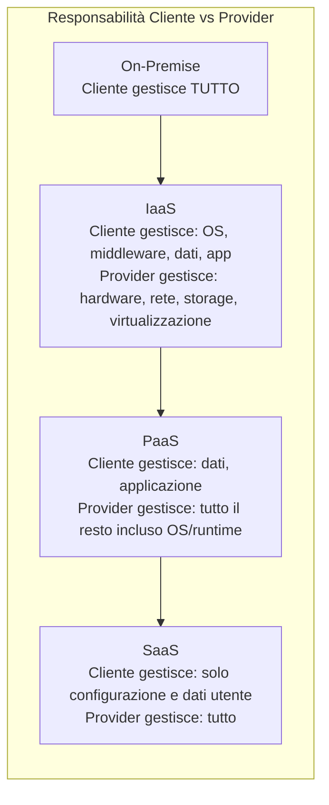

# Materia 2 — Infrastrutture ICT On-Premise e Cloud
*Materiale di studio per la prova scritta MIT-EPI (60 quiz/70 min, soglia 21/30)*

---

## 2.1 Infrastruttura on-premise: componenti e caratteristiche

L'infrastruttura **on-premise** è posseduta e gestita direttamente dall'organizzazione all'interno di data center propri (o in colocation).

* **Componenti tipiche**: server fisici (rack/blade), storage (SAN/NAS), apparati di rete (switch, router, firewall), sistemi di raffreddamento e alimentazione ridondata (UPS, gruppi elettrogeni), virtualizzazione (hypervisor come VMware ESXi, KVM, Hyper-V) per consolidare più macchine virtuali su hardware fisico condiviso.
* **Vantaggi**: controllo diretto e totale su hardware/dati (rilevante per dati **critici/strategici** secondo la classificazione ACN), nessuna dipendenza da un fornitore esterno, personalizzazione completa, possibile requisito normativo per dati sensibili con vincoli di sovranità.
* **Svantaggi**: costi **CapEx** (Capital Expenditure) elevati e anticipati per hardware, tempi di provisioning lunghi, scalabilità limitata dalla capacità fisica installata, piena responsabilità interna su manutenzione, patching, disaster recovery e obsolescenza tecnologica.

## 2.2 Modelli di cloud computing: IaaS, PaaS, SaaS

| Modello | Cosa fornisce il provider | Cosa gestisce il cliente | Esempio |
|---|---|---|---|
| **IaaS** (Infrastructure as a Service) | Server virtuali, storage, rete | OS, middleware, runtime, applicazione, dati | VM su AWS EC2, Azure VM |
| **PaaS** (Platform as a Service) | Infrastruttura + OS + runtime/middleware | Solo il codice applicativo e i dati | Database as a Service, App Service |
| **SaaS** (Software as a Service) | Applicazione completa e pronta all'uso | Solo configurazione utente e dati immessi | Posta elettronica cloud, CRM cloud |

* Principio **Cloud First** della PA italiana: a parità di requisiti, si privilegia **SaaS > PaaS > IaaS**, perché delega al provider (qualificato) la maggior parte degli oneri operativi e di sicurezza, riducendo TCO e responsabilità di gestione interna.
* **Modelli di deployment cloud**:
  * **Pubblico**: infrastruttura condivisa multi-tenant gestita da un provider terzo, accessibile via Internet — economico e scalabile, minor controllo.
  * **Privato**: infrastruttura dedicata a una sola organizzazione (on-premise o hosted) — maggior controllo/sicurezza, costi più alti.
  * **Ibrido**: combina pubblico e privato con orchestrazione tra i due — tipico della PA per bilanciare sovranità del dato (workload critici on-prem/privato) ed elasticità (workload ordinari su pubblico).
  * **Multi-cloud**: uso di più provider pubblici contemporaneamente, per evitare **vendor lock-in** e aumentare la resilienza.

## 2.3 Caratteristiche essenziali del cloud (definizione NIST)

Il NIST individua 5 caratteristiche che definiscono il cloud computing:
1. **On-demand self-service**: il consumatore può approvvigionare risorse autonomamente, senza interazione umana col provider.
2. **Broad network access**: accesso via rete standard (Internet) da eterogenei dispositivi client.
3. **Resource pooling**: risorse del provider condivise (multi-tenant) tra più clienti, allocate dinamicamente.
4. **Rapid elasticity**: capacità di scalare rapidamente su o giù, anche automaticamente, in base alla domanda.
5. **Measured service**: uso monitorato, controllato e fatturato in base al consumo effettivo (**pay-as-you-go**).

## 2.4 Sicurezza, sovranità del dato e classificazione (contesto PA italiana)

* **Modello di responsabilità condivisa**: la sicurezza in cloud è sempre divisa tra provider (sicurezza *del* cloud: infrastruttura fisica, virtualizzazione) e cliente (sicurezza *nel* cloud: configurazione, identity management, dati, applicazione) — la ripartizione esatta dipende dal modello (IaaS richiede più responsabilità al cliente di un SaaS).
* **Classificazione dei dati (Regolamento ACN)**: **Ordinari** (impatto basso, possono andare su cloud pubblico qualificato), **Critici** (impatto rilevante su funzioni istituzionali), **Strategici** (essenziali per la sicurezza nazionale) — questi ultimi due devono risiedere su infrastrutture ad altissima affidabilità e sotto giurisdizione italiana/UE, tipicamente il **Polo Strategico Nazionale (PSN)**.
* **Qualificazione CSP**: solo i Cloud Service Provider accreditati tramite il processo di valutazione ACN/AGID (marketplace qualificato) possono ospitare workload della PA — requisito prima di ogni scelta architetturale.
* **Vendor lock-in**: rischio di dipendenza tecnica/contrattuale da un singolo provider che rende costoso o complesso migrare altrove — si mitiga con standard aperti, containerizzazione portabile, strategie multi-cloud e clausole contrattuali di **exit strategy** (rilevanti anche ai fini DORA per il settore finanziario).

## 2.5 Alta disponibilità, resilienza e disaster recovery

* **Ridondanza**: duplicazione di componenti critici per eliminare singoli punti di guasto (**SPOF — Single Point of Failure**). Pattern: **N+1** (una unità di scorta oltre al minimo necessario), **Active-Active** (tutti i nodi servono traffico) vs **Active-Passive** (un nodo di backup subentra solo in caso di guasto).
* **Availability Zone (AZ) / Region**: i provider cloud distribuiscono i data center in zone fisicamente separate (stessa area geografica ma alimentazione/rete indipendenti) e regioni geografiche distinte — distribuire un servizio su più AZ aumenta la resilienza a guasti localizzati.
* **Metriche chiave di continuità operativa**:
  * **RTO (Recovery Time Objective)**: tempo massimo tollerabile per ripristinare il servizio dopo un'interruzione.
  * **RPO (Recovery Point Objective)**: quantità massima di dati (espressa in tempo) che è accettabile perdere in caso di disastro — determina la frequenza minima dei backup/replica.
  * Un RTO/RPO vicini a zero richiedono architetture costose (replica sincrona multi-sito); valori più ampi permettono soluzioni più economiche (backup periodici).
* **Load balancing**: distribuzione del traffico su più istanze per prestazioni e resilienza — algoritmi comuni: round robin, least connections, basato su health check (esclude automaticamente nodi non sani).
* **SLA (Service Level Agreement)**: contratto che definisce i livelli di servizio garantiti (uptime, tempi di risposta al supporto) — tipicamente espresso in "9" di disponibilità (es. 99,9% = ~8,7 ore di downtime/anno; 99,99% = ~52 minuti/anno).

## 2.6 Reti e sicurezza perimetrale (elementi trasversali on-prem/cloud)

* **Segmentazione di rete**: suddivisione della rete in segmenti isolati (VLAN on-prem, VPC/subnet in cloud) per limitare la superficie di attacco e il movimento laterale in caso di compromissione.
* **Firewall e sicurezza perimetrale**: filtraggio del traffico basato su regole (IP, porte, protocolli); **WAF (Web Application Firewall)** per filtrare traffico applicativo HTTP/S contro attacchi noti (SQL injection, XSS).
* **VPN e connettività ibrida**: **Site-to-Site VPN** o connessioni dedicate (es. AWS Direct Connect, Azure ExpressRoute) per collegare in modo sicuro data center on-premise e ambienti cloud, evitando l'esposizione diretta a Internet pubblico.
* **Zero Trust**: modello di sicurezza che abbandona il concetto di "perimetro fidato" — ogni richiesta di accesso (interna o esterna) viene autenticata, autorizzata e verificata continuamente ("never trust, always verify"), indipendentemente dalla posizione di rete da cui proviene.

---

## Domande di autoverifica

1. **In quale modello di cloud computing il cliente gestisce solo l'applicazione e i dati, mentre il provider fornisce anche OS e runtime?**
   a) IaaS
   b) PaaS
   c) SaaS
   d) On-premise
   **Risposta: b)** — nel PaaS il provider fornisce piattaforma completa (OS, middleware, runtime), il cliente si occupa solo del codice/dati.

2. **Cosa indica il parametro RPO (Recovery Point Objective)?**
   a) Il tempo massimo per ripristinare il servizio
   b) La quantità massima di dati che si è disposti a perdere in caso di disastro
   c) Il costo massimo tollerabile di un'interruzione
   d) Il numero di repliche attive di un sistema
   **Risposta: b)** — RPO misura la perdita dati accettabile (in termini di tempo trascorso dall'ultimo backup/replica); RTO misura invece il tempo di ripristino.

3. **Secondo la classificazione ACN dei dati della PA, dove devono risiedere obbligatoriamente i dati "critici" e "strategici"?**
   a) Su qualsiasi cloud pubblico internazionale
   b) Su infrastrutture ad altissima affidabilità sotto giurisdizione italiana/UE, tipicamente il PSN
   c) Sempre e solo su supporti fisici offline
   d) Non esiste alcun vincolo di localizzazione
   **Risposta: b)** — è il principio cardine della Strategia Cloud Italia per la sovranità del dato.

4. **Quale caratteristica NIST del cloud computing descrive la capacità di scalare automaticamente le risorse in base alla domanda?**
   a) Resource pooling
   b) Broad network access
   c) Rapid elasticity
   d) Measured service
   **Risposta: c)** — la "rapid elasticity" è specificamente la capacità di scalare rapidamente su/giù.

5. **Il modello di sicurezza "Zero Trust" si basa sul principio che:**
   a) Il traffico interno alla rete aziendale è sempre fidato per definizione
   b) Solo il traffico esterno va verificato
   c) Ogni richiesta va sempre autenticata e autorizzata, indipendentemente dalla provenienza
   d) È sufficiente un firewall perimetrale ben configurato
   **Risposta: c)** — Zero Trust elimina il concetto di perimetro fidato, verificando sempre ogni accesso.

6. **Un'architettura "ibrida" nel contesto cloud della PA italiana serve tipicamente a:**
   a) Eliminare completamente l'uso di cloud pubblico
   b) Bilanciare sovranità/sicurezza dei dati critici (on-prem/privato) con elasticità dei carichi ordinari (pubblico qualificato)
   c) Ridurre a zero i costi infrastrutturali
   d) Sostituire la necessità di disaster recovery
   **Risposta: b)** — è la motivazione architetturale tipica dell'approccio ibrido nella PA.
