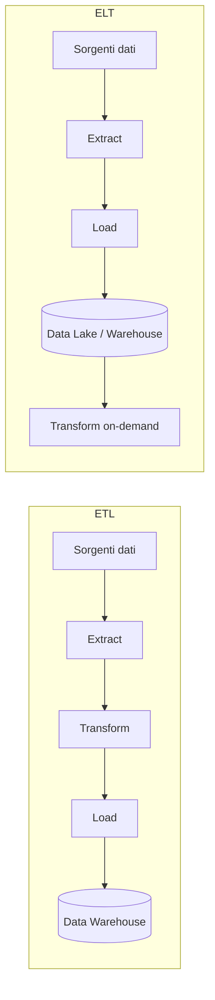

# Materia 3 — Database, Data Analysis e Big Data
*Materiale di studio per la prova scritta del concorso MIT-EPI (60 quesiti a risposta multipla, 70 minuti)*

---

## 1. Modelli di dati relazionali vs NoSQL

### 1.1 Il modello relazionale (RDBMS)
Un database relazionale organizza i dati in **tabelle** (relazioni) composte da righe (tuple) e colonne (attributi). Ogni tabella ha una **chiave primaria** (Primary Key, PK) che identifica univocamente ogni riga, e può contenere **chiavi esterne** (Foreign Key, FK) che referenziano la PK di un'altra tabella, garantendo l'**integrità referenziale**.

* **Linguaggio:** SQL (Structured Query Language) — DDL (CREATE, ALTER, DROP), DML (SELECT, INSERT, UPDATE, DELETE), DCL (GRANT, REVOKE).
* **Prodotti tipici:** PostgreSQL, MySQL/MariaDB, Oracle Database, Microsoft SQL Server.
* **Proprietà ACID** (garantite dalle transazioni RDBMS):
  * **Atomicity (Atomicità):** una transazione è indivisibile — o va tutta a buon fine (commit) o viene annullata interamente (rollback).
  * **Consistency (Coerenza):** ogni transazione porta il database da uno stato valido a un altro stato valido, rispettando vincoli e regole di integrità.
  * **Isolation (Isolamento):** transazioni concorrenti non si influenzano a vicenda come se fossero eseguite in sequenza (livelli di isolamento: Read Uncommitted, Read Committed, Repeatable Read, Serializable).
  * **Durability (Durabilità):** una volta confermata (commit), una transazione sopravvive a crash di sistema (scritta su storage persistente, es. tramite write-ahead log).

### 1.2 Il modello NoSQL
Nato per rispondere a esigenze di scalabilità orizzontale e schema flessibile che il modello relazionale gestisce con difficoltà su grandi volumi distribuiti. Quattro famiglie principali:

| Tipo | Struttura dati | Esempi | Caso d'uso tipico |
|---|---|---|---|
| **Key-Value** | coppie chiave→valore, accesso O(1) | Redis, DynamoDB | cache, sessioni utente |
| **Document store** | documenti semi-strutturati (JSON/BSON) | MongoDB, CouchDB | cataloghi prodotti, CMS |
| **Column-family** | colonne raggruppate per famiglia, ottimizzato per scritture massive | Cassandra, HBase | time-series, log, IoT |
| **Graph database** | nodi e archi con proprietà, ottimizzato per relazioni | Neo4j, ArangoDB | reti sociali, frodi, raccomandazioni |

### 1.3 ACID vs BASE
I sistemi NoSQL distribuiti spesso rinunciano alla piena coerenza ACID a favore del modello **BASE**:
* **Basically Available:** il sistema garantisce disponibilità anche in condizioni di guasto parziale.
* **Soft state:** lo stato del sistema può cambiare nel tempo anche senza input, per via della propagazione asincrona.
* **Eventually consistent:** la coerenza tra le repliche viene raggiunta *col tempo*, non immediatamente dopo la scrittura.

*Sintesi per l'esame*: se una domanda contrappone "coerenza forte e immediata" a "disponibilità e scalabilità", la prima risposta è ACID/RDBMS, la seconda è BASE/NoSQL.

## 2. Il teorema CAP
Formulato da Eric Brewer: in un sistema distribuito è possibile garantire **al massimo due** delle seguenti tre proprietà **contemporaneamente**, in presenza di una partizione di rete:

* **Consistency (C):** tutti i nodi vedono gli stessi dati nello stesso momento.
* **Availability (A):** ogni richiesta riceve una risposta (non un errore), anche se non è la più recente.
* **Partition tolerance (P):** il sistema continua a funzionare anche se la rete si divide in partizioni che non comunicano tra loro.

Poiché in un sistema distribuito reale le partizioni di rete **possono sempre verificarsi**, la scelta pratica è tra:
* **CP** (Consistency + Partition tolerance): sacrifica la disponibilità in caso di partizione (es. MongoDB in configurazioni strict, HBase).
* **AP** (Availability + Partition tolerance): sacrifica la coerenza immediata, adotta eventual consistency (es. Cassandra, DynamoDB).

*Sintesi per l'esame*: CAP si applica **solo quando c'è una partizione di rete**; in condizioni normali un sistema può offrire sia C che A. Non esiste un sistema "CA" puro in un ambiente distribuito reale (un solo nodo non è distribuito).

## 3. Normalizzazione (1NF, 2NF, 3NF)
La normalizzazione riduce ridondanza e anomalie di aggiornamento/inserimento/cancellazione, scomponendo le tabelle secondo regole progressive.

**Esempio di partenza (tabella non normalizzata):**

| OrdineID | Cliente | Prodotto | PrezzoProdotto | QuantitàOrdinata |
|---|---|---|---|---|
| 1 | Rossi | Vite M6 | 0,10 | 100 |
| 1 | Rossi | Bullone | 0,15 | 50 |
| 2 | Bianchi | Vite M6 | 0,10 | 200 |

* **1NF (Prima Forma Normale):** ogni cella contiene un solo valore atomico (no liste/array in una cella) e ogni riga è identificabile univocamente. La tabella sopra è già in 1NF se non ci sono valori multipli per cella.
* **2NF (Seconda Forma Normale):** 1NF + ogni attributo non-chiave dipende dall'**intera** chiave primaria (elimina le dipendenze parziali quando la PK è composta). Nell'esempio, `PrezzoProdotto` dipende solo da `Prodotto`, non dalla coppia (OrdineID, Prodotto) → va spostato in una tabella `Prodotti` separata.
* **3NF (Terza Forma Normale):** 2NF + nessun attributo non-chiave dipende da un altro attributo non-chiave (elimina le dipendenze transitive). Risultato finale: tre tabelle — `Ordini` (OrdineID, Cliente), `RigheOrdine` (OrdineID, Prodotto, QuantitàOrdinata), `Prodotti` (Prodotto, PrezzoProdotto).

*Sintesi per l'esame*: normalizzare riduce la ridondanza ma può aumentare il numero di JOIN necessari nelle query (trade-off tra integrità e performance). La **denormalizzazione controllata** è spesso usata nei data warehouse per velocizzare le letture analitiche.

## 4. Indici e query plan
* **Indice:** struttura dati ausiliaria (tipicamente B-Tree o hash) che velocizza la ricerca di righe evitando la scansione completa della tabella (*full table scan*). Ha un costo in termini di spazio e di rallentamento delle scritture (ogni INSERT/UPDATE deve aggiornare anche l'indice).
* **Query plan (piano di esecuzione):** il DBMS, tramite l'**ottimizzatore di query**, sceglie la strategia più efficiente per eseguire una query (quale indice usare, ordine dei JOIN, algoritmo di join — nested loop, hash join, merge join). Comandi come `EXPLAIN` (PostgreSQL/MySQL) mostrano il piano scelto.
* **Indici compositi:** su più colonne, utili quando le query filtrano/ordinano su quelle colonne insieme; l'ordine delle colonne nell'indice conta (principio del *leftmost prefix*).

## 5. Data Lake vs Data Warehouse

| Caratteristica | Data Warehouse | Data Lake |
|---|---|---|
| Schema | **schema-on-write** (definito prima di caricare) | **schema-on-read** (definito al momento dell'analisi) |
| Tipo di dati | strutturati | strutturati, semi-strutturati, non strutturati |
| Elaborazione | dati puliti, trasformati (ETL) | dati grezzi, spesso raw |
| Utenti tipici | analisti di business, reportistica | data scientist, ML engineer |
| Costo storage | più alto (ottimizzato per query) | più basso (storage a basso costo, es. object storage) |
| Rischio | rigidità, minor flessibilità | "data swamp" se non governato |

Un'architettura moderna spesso combina i due livelli: **Data Lakehouse**, che applica governance e struttura tipiche del warehouse sopra uno storage economico e flessibile tipico del lake.

## 6. ETL vs ELT
* **ETL (Extract, Transform, Load):** i dati vengono estratti dalla sorgente, **trasformati** (pulizia, normalizzazione, arricchimento) in un motore intermedio, e poi caricati nel data warehouse già pronti per l'analisi. Approccio classico, adatto a dati strutturati e volumi moderati.
* **ELT (Extract, Load, Transform):** i dati grezzi vengono caricati prima nel sistema di destinazione (spesso un data lake o warehouse cloud potente) e trasformati **dopo**, sfruttando la potenza di calcolo del target. Più adatto a big data e architetture cloud-native.

## 7. Batch processing vs Stream processing

| Aspetto | Batch processing | Stream processing |
|---|---|---|
| Dati elaborati | grandi volumi accumulati | flusso continuo, evento per evento |
| Latenza | minuti/ore | millisecondi/secondi (near real-time) |
| Tecnologie | Hadoop MapReduce, Apache Spark (batch) | Apache Kafka, Apache Flink, Spark Streaming |
| Caso d'uso | reportistica notturna, elaborazioni storiche | monitoraggio infrastrutture, IoT, rilevamento frodi in tempo reale |

* **Hadoop:** ecosistema per elaborazione distribuita di grandi volumi, basato su **HDFS** (Hadoop Distributed File System, replica i blocchi su più nodi) e paradigma **MapReduce** (fase Map che distribuisce il calcolo, fase Reduce che aggrega i risultati).
* **Apache Spark:** motore di elaborazione distribuita in-memory, molto più veloce di MapReduce puro su carichi iterativi; supporta sia batch che (micro-)streaming.
* **Apache Kafka:** piattaforma di **messaggistica distribuita** basata su publish/subscribe con **topic** partizionati; usata come "sistema nervoso" per l'ingestione di dati in tempo reale (es. sensori IoT su infrastrutture, log applicativi).

## 8. Le "V" del Big Data
* **Volume:** quantità di dati generati (terabyte/petabyte).
* **Velocity (Velocità):** rapidità con cui i dati vengono generati e devono essere elaborati.
* **Variety (Varietà):** eterogeneità dei formati (strutturati, semi-strutturati come JSON/XML, non strutturati come testo/immagini/video).
* **Veracity (Veridicità):** affidabilità e qualità dei dati, spesso rumorosi o incompleti.
* **Value (Valore):** il vantaggio informativo/decisionale estraibile dai dati — è l'obiettivo finale che giustifica l'investimento sulle altre 4 V.

*Sintesi per l'esame*: le prime 3 V (Volume, Velocity, Variety) sono quelle "storiche" (definizione originale Gartner/Laney); Veracity e Value sono estensioni successive comunemente citate.

---

## Domande di autoverifica

1. **Quale proprietà ACID garantisce che una transazione, una volta confermata, sopravviva anche a un crash del sistema?**
   a) Atomicity b) Consistency c) Isolation d) **Durability** — corretto: la durabilità implica persistenza su storage non volatile dopo il commit.

2. **Secondo il teorema CAP, un sistema che sceglie AP in caso di partizione di rete sta rinunciando a:**
   a) Availability b) **Consistency forte** c) Partition tolerance d) Nessuna delle tre — corretto: AP privilegia disponibilità e tolleranza di partizione, accettando eventual consistency.

3. **In quale forma normale si eliminano le dipendenze transitive tra attributi non-chiave?**
   a) 1NF b) 2NF c) **3NF** d) BCNF — corretto: la 3NF richiede che nessun attributo non-chiave dipenda da un altro attributo non-chiave.

4. **Quale coppia tecnologia/paradigma è corretta per l'elaborazione di dati in tempo reale da sensori IoT?**
   a) Hadoop MapReduce b) **Apache Kafka** c) Data Warehouse relazionale d) OLTP batch nightly — corretto: Kafka è progettato per l'ingestione/streaming di eventi ad alta frequenza.

5. **Cosa distingue principalmente ELT da ETL?**
   a) ELT non trasforma mai i dati b) **ELT carica i dati grezzi nel target e li trasforma successivamente, sfruttando la potenza di calcolo di destinazione** c) ELT è utilizzabile solo con database relazionali d) ETL è più recente di ELT — corretto: la differenza sta nell'ordine Load/Transform e nel luogo dove avviene la trasformazione.

6. **Un data lake, rispetto a un data warehouse, si caratterizza per:**
   a) schema-on-write rigido b) **schema-on-read e capacità di ospitare dati non strutturati** c) costi di storage sempre più alti d) essere utilizzabile solo da analisti di business — corretto: il data lake applica lo schema al momento della lettura/analisi, non al caricamento.
