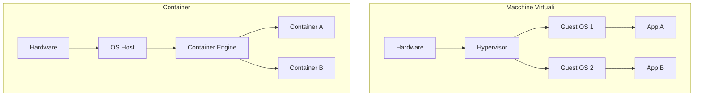

# Materia 5 — Progettazione e Sviluppo di Ambienti Cloud
*Materiale di studio per la prova scritta MIT-EPI (60 quiz/70 min, soglia 21/30)*

---

## 5.1 Percorsi di migrazione al cloud ("le R della migrazione")

Quando un'organizzazione sposta un carico di lavoro esistente verso il cloud, il Manuale AGID e la prassi di settore individuano percorsi con effort e benefici crescenti:

| Percorso | Descrizione | Effort | Beneficio cloud-native |
|---|---|---|---|
| **Rehost** ("Lift & Shift") | Sposta le VM così come sono su infrastruttura IaaS, senza modifiche al codice | Minimo | Minimo (si ottiene solo elasticità infrastrutturale di base) |
| **Replatform** | Migrazione con modifiche minime, es. sostituendo un DB self-hosted con un DBaaS gestito | Medio | Medio (si delega la manutenzione della piattaforma al provider) |
| **Rearchitect / Refactor** | Riprogettazione dell'applicazione in ottica cloud-native (microservizi, container, serverless) | Massimo | Massimo (scalabilità, resilienza e agilità piena) |
| **Repurchase** | Sostituzione dell'applicazione con un prodotto SaaS equivalente | Variabile | Delega totale della gestione tecnica |
| **Retire** | Dismissione di sistemi non più necessari | — | Riduzione del perimetro da mantenere |
| **Retain** | Mantenimento on-premise (per vincoli normativi, tecnici o di costo) | — | Nessuno (scelta consapevole di non migrare) |

*Sintesi per l'esame*: se la domanda descrive "spostamento di VM senza modifiche" → **Rehost**; se descrive "riprogettazione a microservizi per sfruttare a pieno il cloud" → **Rearchitect**; una via di mezzo con "uso di un servizio gestito ma stesso codice applicativo" → **Replatform**.

## 5.2 Containerizzazione: fondamenti

* **Container vs macchina virtuale (VM)**: una VM virtualizza l'intero hardware e richiede un **hypervisor** più un sistema operativo guest completo per istanza (pesante, isolamento forte); un **container** virtualizza solo a livello di processo/sistema operativo (condivide il kernel dell'host), è quindi molto più leggero, veloce da avviare e denso in termini di risorse, con isolamento meno forte di una VM.

* **Docker**: piattaforma di containerizzazione più diffusa. Concetti chiave:
  * **Immagine**: template immutabile e versionato (costruito a **layer** sovrapposti tramite un `Dockerfile`) da cui si istanziano i container.
  * **Container**: istanza in esecuzione di un'immagine, isolata ma leggera.
  * **Registry** (es. Docker Hub, registry privati): repository per la distribuzione delle immagini.
* **Vantaggi della containerizzazione**: portabilità ("funziona uguale ovunque" — elimina il problema "sul mio PC funzionava"), densità (più container per host rispetto a VM), avvio quasi istantaneo, coerenza tra ambienti di sviluppo/test/produzione.
* **Trade-off di sicurezza**: l'isolamento più debole rispetto alle VM (kernel condiviso) richiede attenzione extra: immagini minimali (ridurre superficie di attacco), scanning delle immagini (vulnerabilità nelle dipendenze), esecuzione dei container con privilegi minimi (mai come root se evitabile), aggiornamento continuo delle immagini base.

## 5.3 Orchestrazione: Kubernetes

**Kubernetes (K8s)** è la piattaforma standard de facto per orchestrare container su larga scala, gestendone il ciclo di vita su un cluster di nodi.

* **Componenti principali**:
  * **Pod**: unità minima di deployment in K8s, contiene uno o più container che condividono rete e storage.
  * **Node**: macchina (fisica o virtuale) del cluster su cui girano i Pod.
  * **Cluster**: insieme di nodi coordinati da un **Control Plane** (che include lo scheduler, l'API server, l'etcd come datastore di stato).
  * **Deployment**: descrive lo stato desiderato (numero di repliche di un Pod) e gestisce aggiornamenti/rollback.
  * **Service**: astrazione di rete stabile per esporre un insieme di Pod (che sono effimeri e cambiano IP), abilitando load balancing interno.
  * **Namespace**: partizione logica del cluster per isolare ambienti/team/progetti.
* **Funzionalità chiave**:
  * **Auto-scaling**: orizzontale (Horizontal Pod Autoscaler, aggiunge/rimuove repliche in base al carico) e verticale (regola le risorse assegnate a un Pod).
  * **Self-healing**: riavvio automatico di container falliti, sostituzione di Pod su nodi guasti, rimozione dal load balancing di istanze che falliscono gli **health check** (liveness/readiness probe).
  * **Rolling update**: aggiornamento progressivo delle repliche di un'applicazione senza downtime, con possibilità di **rollback** automatico in caso di errore.
  * **Service discovery**: i Pod si trovano tra loro tramite DNS interno al cluster, senza indirizzi IP statici.
* **Trade-off**: Kubernetes introduce notevole complessità operativa (curva di apprendimento, gestione del control plane, networking) — è giustificato per applicazioni a microservizi su scala significativa, meno per applicazioni semplici o monolitiche a basso traffico (dove il beneficio non compensa l'overhead gestionale).

## 5.4 Infrastructure as Code (IaC) per ambienti cloud

* **Approccio dichiarativo** (si descrive lo stato finale desiderato, è il sistema a determinare come raggiungerlo — es. **Terraform**) vs **approccio imperativo** (si descrive la sequenza di comandi da eseguire — es. script bash tradizionali).
* **Terraform**: strumento IaC multi-cloud e dichiarativo; mantiene uno **state file** che rappresenta lo stato corrente dell'infrastruttura, confrontato a ogni esecuzione con lo stato desiderato per calcolare le modifiche necessarie (`plan`/`apply`).
* **Ansible**: strumento di *configuration management* (non solo provisioning), agentless (si connette via SSH), basato su **playbook** YAML — usato tipicamente per configurare software/servizi su macchine già provisionate.
* **Benefici IaC**: riproducibilità (stesso ambiente ricreabile in modo identico), versionamento (storia delle modifiche in Git, con relativo audit trail), riduzione del **configuration drift** (disallineamento tra ambienti dovuto a modifiche manuali non tracciate), velocità di provisioning.

## 5.5 Architetture cloud-native e serverless

* **Cloud-native**: approccio progettuale che sfrutta appieno le caratteristiche del cloud (elasticità, resilienza distribuita, automazione) tramite microservizi, container, API dichiarative e infrastruttura immutabile — non è solo "eseguire su cloud", ma "progettare per il cloud".
* **Serverless / FaaS (Function as a Service)**: il provider gestisce interamente l'infrastruttura di esecuzione; lo sviluppatore fornisce solo funzioni event-driven, senza doversi occupare di provisioning o scaling manuale dei server.
  * *Vantaggi*: nessuna gestione di server, scalabilità automatica fino a zero (si paga solo per il tempo di esecuzione effettivo), ideale per carichi episodici/imprevedibili.
  * *Svantaggi*: **cold start** (latenza alla prima invocazione dopo un periodo di inattività), vendor lock-in elevato, limiti di durata/esecuzione per singola funzione, difficoltà di debug/testing locale.
* **Event-driven architecture**: i componenti comunicano tramite eventi asincroni (pubblicati su un bus/broker) anziché chiamate dirette sincrone — disaccoppia produttori e consumatori, aumenta la resilienza (un consumer down non blocca il producer) a costo di maggiore complessità nella gestione della coerenza e nel debug end-to-end.

## 5.6 Sicurezza e governance degli ambienti cloud

* **IAM (Identity and Access Management)**: gestione centralizzata di identità e permessi in cloud, basata sul **principio del privilegio minimo** (least privilege) — ogni identità (utente, servizio, applicazione) ha solo i permessi strettamente necessari.
* **Secrets management**: credenziali, chiavi API e certificati non devono mai essere hardcoded nel codice o nelle immagini container, ma gestiti tramite vault dedicati (es. HashiCorp Vault, servizi cloud-native di secret management) con accesso controllato e audit.
* **Network policy in Kubernetes**: regole che controllano il traffico consentito tra Pod/namespace, applicando segmentazione anche a livello di orchestrazione (non solo di rete fisica/virtuale sottostante).
* **Qualificazione e compliance**: solo i Cloud Service Provider qualificati ACN/AGID possono ospitare workload della PA italiana; per i dati critici/strategici resta obbligatorio l'uso di infrastrutture come il **PSN (Polo Strategico Nazionale)**.
* **Cost management e FinOps**: la progettazione cloud deve bilanciare anche il costo operativo (**OpEx**, a differenza del CapEx on-premise) — pratiche di ottimizzazione includono il dimensionamento corretto delle risorse (*rightsizing*), l'uso di istanze riservate/spot per carichi prevedibili/tollerabili a interruzione, e il monitoraggio continuo della spesa.

---

## Domande di autoverifica

1. **Quale percorso di migrazione al cloud comporta lo spostamento di macchine virtuali così come sono, senza modifiche al codice applicativo?**
   a) Rearchitect
   b) Rehost
   c) Repurchase
   d) Replatform
   **Risposta: b)** — il Rehost ("Lift & Shift") è la migrazione a minimo effort, senza modifiche.

2. **In Kubernetes, quale componente rappresenta l'unità minima di deployment?**
   a) Node
   b) Cluster
   c) Pod
   d) Namespace
   **Risposta: c)** — il Pod è l'unità minima e può contenere uno o più container che condividono rete e storage.

3. **Rispetto a una macchina virtuale, un container è generalmente più leggero perché:**
   a) Virtualizza l'intero hardware fisico
   b) Condivide il kernel del sistema operativo host anziché includerne uno proprio
   c) Non richiede alcun sistema operativo
   d) Viene eseguito solo su cloud pubblico
   **Risposta: b)** — i container virtualizzano a livello di processo/OS condividendo il kernel host, le VM includono un OS guest completo.

4. **Qual è il principale svantaggio di un'architettura serverless/FaaS?**
   a) Impossibilità di scalare automaticamente
   b) Costo fisso indipendente dall'uso
   c) Cold start e elevato vendor lock-in verso il provider
   d) Obbligo di gestire manualmente i server sottostanti
   **Risposta: c)** — il cold start (latenza alla prima invocazione) e il forte legame alle API proprietarie del provider sono i trade-off tipici del serverless.

5. **Uno strumento di Infrastructure as Code con approccio dichiarativo e state file per gestire infrastrutture multi-cloud è:**
   a) Ansible
   b) Terraform
   c) Un semplice script bash
   d) Kubernetes kubectl
   **Risposta: b)** — Terraform è dichiarativo e multi-cloud, con state file che traccia lo stato corrente dell'infrastruttura.

6. **Il principio del "privilegio minimo" (least privilege) nella gestione IAM in cloud significa:**
   a) Concedere tutti i permessi di default e poi eventualmente revocarli
   b) Ogni identità ha solo i permessi strettamente necessari al proprio compito
   c) Solo gli amministratori hanno accesso al sistema
   d) I permessi non vanno mai rivisti dopo l'assegnazione iniziale
   **Risposta: b)** — è la definizione standard del principio, cardine anche della sicurezza Zero Trust.
