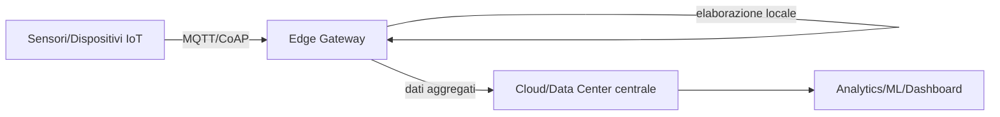

# Materia 6 — Machine Learning, IoT, Intelligenza Artificiale (IA)

Materiale di studio per la prova scritta del concorso MIT-EPI (60 quiz a risposta multipla in 70 minuti, +0,50 risposta esatta / 0 mancata / -0,10 errata, soglia 21/30).

---

## 1. Machine Learning: tipi di apprendimento

### 1.1 Apprendimento supervisionato
Il modello apprende da un dataset **etichettato** (coppie input→output noto) e generalizza per predire output su dati nuovi.

| Compito | Algoritmi tipici | Esempio d'uso |
|---|---|---|
| Regressione (output continuo) | Regressione lineare, regressione polinomiale, Support Vector Regression | Previsione del traffico su una tratta autostradale |
| Classificazione (output discreto) | Regressione logistica, alberi decisionali, Random Forest, Support Vector Machine (SVM), k-Nearest Neighbors (k-NN), reti neurali | Classificazione di un'email come spam/non spam; individuazione di anomalie strutturali in un ponte come "critico/non critico" |

- **Alberi decisionali**: struttura a nodi che divide ricorsivamente i dati sulla base di soglie su singole feature; interpretabili ma soggetti a overfitting se non potati (pruning).
- **Random Forest**: ensemble di molti alberi decisionali addestrati su sottoinsiemi casuali di dati/feature (bagging); riduce la varianza rispetto a un singolo albero.
- **SVM**: cerca l'iperpiano che massimizza il margine di separazione tra classi; efficace in spazi ad alta dimensionalità.

### 1.2 Apprendimento non supervisionato
Il modello lavora su dati **non etichettati**, cercando struttura o pattern nascosti.

| Compito | Algoritmi tipici | Esempio d'uso |
|---|---|---|
| Clustering | K-means, clustering gerarchico, DBSCAN | Segmentazione di utenti di un servizio digitale della PA in base al comportamento d'uso |
| Riduzione della dimensionalità | Principal Component Analysis (PCA), t-SNE | Compressione di dataset ad alta dimensionalità per visualizzazione o pre-processing |
| Associazione | Apriori, FP-Growth | Individuazione di pattern ricorrenti in log di sistema (utile anche in cybersecurity, vedi anomaly detection) |

- **K-means**: partiziona i dati in *k* cluster minimizzando la distanza di ogni punto dal centroide del proprio cluster; richiede di fissare *k* a priori.

### 1.3 Apprendimento per rinforzo (Reinforcement Learning)
Un **agente** interagisce con un **ambiente**, compie **azioni** e riceve **reward** (rinforzo positivo) o **penalty** (rinforzo negativo); l'obiettivo è apprendere una **policy** che massimizzi il reward cumulativo nel tempo.
- Concetti chiave: stato (state), azione (action), reward, policy, trade-off *exploration vs exploitation* (esplorare nuove azioni vs sfruttare quelle già note come efficaci).
- Esempio d'uso nel contesto MIT: ottimizzazione dinamica della segnaletica semaforica o della gestione del traffico ferroviario in tempo reale.

### 1.4 Deep Learning (cenni)
Sottoinsieme del ML basato su **reti neurali artificiali** multi-strato (deep = molti layer nascosti). Ogni neurone applica una trasformazione lineare seguita da una funzione di attivazione non lineare (es. ReLU, sigmoide). Architetture rilevanti:
- **CNN (Convolutional Neural Network)**: specializzate nell'elaborazione di immagini/video (es. analisi automatica di immagini satellitari o droni per il monitoraggio infrastrutturale).
- **RNN/LSTM**: specializzate in dati sequenziali/temporali (es. serie storiche di traffico, sensori IoT).
- **Transformer**: architettura alla base dei moderni modelli linguistici (LLM), basata sul meccanismo di *attention*.

## 2. Overfitting, underfitting e validazione

- **Underfitting**: il modello è troppo semplice per catturare la struttura dei dati → basse prestazioni sia su training set sia su test set.
- **Overfitting**: il modello si adatta eccessivamente al rumore del training set → ottime prestazioni sul training set ma scarsa capacità di generalizzazione sul test set.
- **Bias-variance trade-off**: l'underfitting è associato ad alto bias, l'overfitting ad alta varianza; l'obiettivo è trovare il punto di equilibrio.

**Tecniche di validazione:**
- **Train/test split**: si divide il dataset in un sottoinsieme di addestramento (tipicamente 70-80%) e uno di test (20-30%), quest'ultimo mai usato in fase di training.
- **Validation set**: un terzo sottoinsieme usato per il tuning degli iperparametri, separato dal test set finale.
- **Cross-validation (k-fold)**: il dataset viene diviso in *k* parti (fold); il modello viene addestrato *k* volte, ogni volta usando *k-1* fold per il training e 1 fold per la validazione, poi si mediano i risultati. Riduce la dipendenza dei risultati da una singola suddivisione casuale dei dati.
- **Regolarizzazione** (L1/Lasso, L2/Ridge, dropout nelle reti neurali): tecniche che penalizzano la complessità del modello per ridurre l'overfitting.

## 3. IoT (Internet of Things)

### 3.1 Architettura di riferimento

### 3.2 Protocolli di comunicazione leggeri
| Protocollo | Modello | Trasporto | Caratteristiche |
|---|---|---|---|
| **MQTT** (Message Queuing Telemetry Transport) | Publish/Subscribe tramite broker | TCP | Basso overhead, adatto a reti con banda limitata o instabile; livelli di Quality of Service (QoS 0/1/2) |
| **CoAP** (Constrained Application Protocol) | Request/Response simile a REST | UDP | Pensato per dispositivi con risorse hardware molto limitate (microcontrollori a bassa potenza) |
| **AMQP** | Publish/Subscribe con garanzie transazionali | TCP | Più pesante di MQTT, usato quando serve affidabilità enterprise nello scambio messaggi |

### 3.3 Edge computing vs Cloud computing
- **Cloud computing**: elaborazione centralizzata su data center remoti; latenza più alta, ma capacità di calcolo e storage praticamente illimitate.
- **Edge computing**: elaborazione **vicino alla sorgente dei dati** (sul gateway o sul dispositivo stesso), riduce la latenza e il traffico di rete verso il cloud, migliora la resilienza in caso di connettività instabile — cruciale per il monitoraggio in tempo reale di infrastrutture critiche (es. sensori su ponti, dighe, gallerie).
- **Fog computing**: livello intermedio tra edge e cloud, distribuisce l'elaborazione su nodi di rete intermedi (router, gateway locali).

### 3.4 Applicazioni IoT nel contesto MIT
- Monitoraggio strutturale (Structural Health Monitoring) di ponti, viadotti e dighe tramite sensori di vibrazione, inclinazione, deformazione.
- Sistemi di trasporto intelligente (ITS - Intelligent Transportation Systems): sensori di traffico, telecamere, sistemi di pedaggio elettronico.
- Manutenzione predittiva su asset ferroviari e stradali, tramite l'incrocio di dati IoT con modelli di ML.

## 4. Intelligenza Artificiale nella PA: il quadro normativo AI Act

L'**AI Act** (Regolamento UE sull'Intelligenza Artificiale) adotta un approccio **risk-based**, proporzionale al rischio che un sistema di IA comporta per i diritti fondamentali (vedi anche [`AGID_Sintesi_Preparazione_Concorso.md` §11](../../AGID_Sintesi_Preparazione_Concorso.md)).

| Livello di rischio | Descrizione | Esempio nel contesto PA/infrastrutture |
|---|---|---|
| **Inaccettabile** | Sistemi vietati in quanto violano diritti fondamentali | Sistemi di social scoring governativo, sorveglianza biometrica di massa in tempo reale in spazi pubblici |
| **Alto** | Sistemi soggetti a requisiti stringenti prima del go-live: tracciabilità (log), trasparenza, gestione del rischio, **supervisione umana obbligatoria** (human-in-the-loop) | Un sistema di IA che decide autonomamente la chiusura precauzionale di un ponte sulla base di dati IoT di monitoraggio strutturale; sistemi di IA usati per l'assegnazione di appalti pubblici o la valutazione di domande dei cittadini |
| **Rischio limitato** | Obblighi di trasparenza verso l'utente | Chatbot istituzionali che devono dichiarare la propria natura artificiale |
| **Rischio minimo** | Nessun obbligo specifico | Filtri antispam, sistemi di raccomandazione non critici |

**Punto d'esame chiave**: per un sistema ML applicato a un'infrastruttura critica (es. previsione di cedimenti strutturali, gestione del traffico ferroviario), la classificazione corretta è quasi sempre **"alto rischio"**, il che implica: dataset di addestramento privi di bias significativi, log completi delle decisioni algoritmiche, possibilità per un operatore umano di annullare o correggere la decisione del sistema (human oversight), documentazione tecnica a supporto di un audit.

## Domande di autoverifica

1. Quale tecnica di validazione riduce la dipendenza dei risultati da una singola suddivisione casuale del dataset?
   a) Train/test split singolo
   b) K-fold cross-validation
   c) Regolarizzazione L1
   d) Clustering K-means
   **Risposta: b)** — la cross-validation ripete l'addestramento su più suddivisioni (fold) e media i risultati, riducendo la varianza della stima delle prestazioni.

2. Un modello con altissima accuratezza sul training set ma prestazioni scarse sul test set è un caso di:
   a) Underfitting
   b) Overfitting
   c) Bias elevato
   d) Apprendimento per rinforzo
   **Risposta: b)** — l'overfitting si manifesta come un divario marcato tra le prestazioni sul training set e quelle sul test set.

3. Quale protocollo IoT è basato su un modello publish/subscribe e su TCP, con overhead ridotto?
   a) CoAP
   b) HTTP/2
   c) MQTT
   d) FTP
   **Risposta: c)** — MQTT è il protocollo publish/subscribe leggero per IoT più diffuso, basato su TCP.

4. Secondo l'AI Act, un sistema di IA utilizzato per decisioni automatizzate sulla chiusura precauzionale di un'infrastruttura critica rientra tipicamente nella categoria di rischio:
   a) Minimo
   b) Limitato
   c) Alto
   d) Inaccettabile
   **Risposta: c)** — impatta su sicurezza e diritti fondamentali con conseguenze rilevanti, richiedendo supervisione umana e tracciabilità.

5. L'edge computing, rispetto al cloud computing puro, offre principalmente il vantaggio di:
   a) Storage illimitato
   b) Ridotta latenza ed elaborazione vicino alla sorgente dei dati
   c) Eliminazione totale della necessità di connettività di rete
   d) Maggiore potenza di calcolo rispetto a qualsiasi data center
   **Risposta: b)** — l'edge computing elabora i dati vicino al sensore/dispositivo, riducendo la latenza e la dipendenza dalla connettività verso il cloud.

6. Nell'apprendimento per rinforzo, il dilemma tra provare nuove azioni e sfruttare quelle già note come efficaci si chiama:
   a) Overfitting-underfitting trade-off
   b) Bias-variance trade-off
   c) Exploration-exploitation trade-off
   d) Precision-recall trade-off
   **Risposta: c)** — è il trade-off fondamentale della policy di un agente di reinforcement learning.
