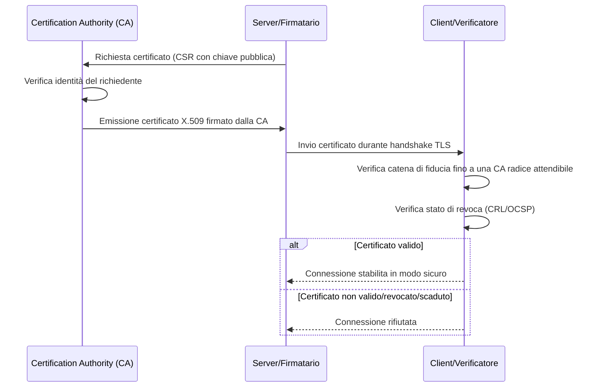

# Materia 7 — Cybersecurity, analisi delle vulnerabilità, soluzioni crittografiche

Materiale di studio per la prova scritta del concorso MIT-EPI. Fonte normativa/tecnica di riferimento: `AGID/pdf/11_All_D_Modellazione_Minacce.pdf` ("Linee Guida per la Modellazione delle Minacce ed Individuazione delle Azioni di Mitigazione conformi ai principi del Secure/Privacy by Design", AGID) e [`Sintesi_Firma_Digitale.md`](../../Sintesi_Firma_Digitale.md) per la parte crittografica/PKI.

---

## 1. I principi CIA (Confidenzialità, Integrità, Disponibilità)

Ogni sistema sicuro deve garantire, per dati e servizi:
- **Confidenzialità (Confidentiality)**: consentire l'accesso alle informazioni solo a soggetti autorizzati.
- **Integrità (Integrity)**: garantire che dati e codice non vengano alterati da soggetti non autorizzati, né in modo accidentale.
- **Disponibilità (Availability)**: garantire che sistemi e dati siano accessibili agli utenti autorizzati quando necessario.

A queste si affianca spesso il **non ripudio**: impossibilità per un soggetto di negare di aver compiuto un'azione (garantito tipicamente da log protetti, firme digitali, marche temporali).

*(Fonte: AGID, Linee Guida Modellazione delle Minacce, §5.2.1)*

## 2. Il modello STRIDE per la classificazione delle minacce

Microsoft ha sviluppato **STRIDE** come metodologia di riferimento per il threat modeling. Ogni lettera identifica una categoria di minaccia e la relativa proprietà di sicurezza violata:

| Minaccia | Proprietà violata | Tecnica di mitigazione principale |
|---|---|---|
| **S**poofing (furto/falsificazione d'identità) | Autenticazione | Password robuste, MFA, certificati X.509, Kerberos |
| **T**ampering (manomissione dati) | Integrità | Hash, firme digitali, ACL, TLS/IPSec |
| **R**epudiation (ripudio di un'azione) | Non ripudio | Logging protetto, firme digitali, marche temporali |
| **I**nformation Disclosure (divulgazione di informazioni) | Confidenzialità | Crittografia, ACL, gestione sicura delle chiavi |
| **D**enial of Service (interruzione del servizio) | Disponibilità | Rate limiting, ridondanza, architetture ad alta disponibilità |
| **E**levation of Privilege (elevazione dei privilegi) | Autorizzazione | Principio del privilegio minimo, RBAC, sandboxing, validazione input |

*(Fonte: AGID, Linee Guida Modellazione delle Minacce, §5.5.4.1, Tabelle 6-8)*

## 3. Tipologie di attacco e contromisure

| Attacco | Descrizione | Contromisura principale |
|---|---|---|
| **Phishing** | Invio di comunicazioni (email, SMS) che impersonano un mittente legittimo per carpire credenziali o indurre azioni dannose | Formazione utenti, filtri anti-phishing, MFA, DMARC/SPF/DKIM per l'email |
| **Ransomware** | Malware che cifra i dati della vittima chiedendo un riscatto per la decifratura | Backup offline/immutabili, segmentazione di rete, patch management, EDR (Endpoint Detection & Response) |
| **DDoS (Distributed Denial of Service)** | Sovraccarico intenzionale di un servizio tramite traffico massivo da fonti distribuite, per renderlo indisponibile | Rate limiting, CDN/anti-DDoS, ridondanza, filtri a livello di rete (ACL) |
| **SQL Injection** | Iniezione di codice SQL malevolo tramite input non validato, per leggere/modificare/distruggere dati o compromettere il DB | Prepared statement/query parametrizzate, stored procedure, validazione input whitelist |
| **Cross-Site Scripting (XSS)** | Iniezione di script malevoli in pagine web visualizzate da altri utenti, per rubare cookie/token di sessione | Escaping dell'output (HTML/JS/CSS/URL), Content Security Policy, flag HTTPOnly sui cookie |
| **Man-in-the-Middle (MITM)** | Un attaccante si interpone tra due parti comunicanti, intercettando o alterando i dati in transito | TLS/HTTPS, certificate pinning, IPSec, autenticazione reciproca |
| **Cross-Site Request Forgery (CSRF)** | Induzione di un utente autenticato a eseguire, a sua insaputa, una richiesta verso un sito su cui ha una sessione attiva | Token CSRF (anti-forgery token) legati alla sessione, controllo dell'header Referer |
| **Buffer Overflow** | Scrittura di dati oltre i limiti di un buffer di memoria, corrompendo dati adiacenti e potenzialmente eseguendo codice arbitrario | Linguaggi memory-safe, ASLR (Address Space Layout Randomization), compilatori con protezioni anti-overflow |

*(Fonte: AGID, Linee Guida Modellazione delle Minacce, §5.5.4.1.1.1–5.5.4.1.1.6 — elenco dettagliato di esempi di minacce per ciascuna categoria STRIDE)*

## 4. Crittografia simmetrica vs asimmetrica

| Aspetto | Crittografia simmetrica | Crittografia asimmetrica |
|---|---|---|
| Chiavi | Una sola chiave condivisa (cifratura e decifratura) | Coppia di chiavi: pubblica (condivisibile) e privata (segreta) |
| Velocità | Molto veloce, adatta a grandi volumi di dati | Più lenta, tipicamente usata per piccoli payload (es. scambio di chiavi, firme) |
| Algoritmi tipici | **AES** (Advanced Encryption Standard, a blocchi, chiavi 128/192/256 bit) | **RSA**, ECC (Elliptic Curve Cryptography) |
| Problema principale | Distribuzione sicura della chiave condivisa tra le parti | Onere computazionale maggiore |
| Uso tipico | Cifratura di dati a riposo (dischi, database) e in transito (dopo l'handshake TLS) | Scambio di chiavi, firma digitale, handshake iniziale TLS |

Nella pratica, i protocolli come **TLS** combinano i due approcci: la crittografia asimmetrica viene usata per autenticare le parti e scambiare in modo sicuro una chiave di sessione simmetrica, che poi cifra il traffico effettivo (per le prestazioni).

### 4.1 Funzioni hash e firma digitale
Una **funzione di hash crittografica** (es. SHA-256) produce un'impronta di lunghezza fissa da un input di lunghezza qualsiasi; è deterministica, non invertibile e resistente alle collisioni (algoritmi di hashing deboli come MD5 e SHA-1 sono oggi considerati non sicuri).

La **firma digitale** combina hash e crittografia asimmetrica: si calcola l'hash del documento e lo si cifra con la **chiave privata** del firmatario; chiunque può verificare la firma decifrando con la **chiave pubblica** e confrontando l'hash ottenuto con quello ricalcolato sul documento. Questo garantisce **integrità, autenticità e non ripudio** — approfondimento completo, incluso il funzionamento passo-passo e il diagramma di sequenza, in [`Sintesi_Firma_Digitale.md`](../../Sintesi_Firma_Digitale.md).

Per la memorizzazione delle **password**, non si usa l'hash puro ma un **hashing salted iterativo** (es. bcrypt, PBKDF2, Argon2): il salt (valore casuale univoco per utente) impedisce l'uso di rainbow table precalcolate, e l'iterazione rallenta gli attacchi a forza bruta. *(Fonte: AGID, Linee Guida Modellazione delle Minacce, §5.2.2.1 — best practice "Memorizzare le password utente utilizzando un algoritmo forte di salted hashing iterativo")*

## 5. PKI (Public Key Infrastructure) e certificati X.509

Una PKI è l'insieme di tecnologie, processi e attori che gestiscono l'emissione, distribuzione, verifica e revoca dei **certificati digitali**.

- **Certificato X.509**: struttura standard che lega una chiave pubblica a un'identità (persona, server, organizzazione), firmata da una Certification Authority (CA).
- **Catena di certificazione**: dal certificato foglia fino a una CA radice (root CA) intrinsecamente attendibile, passando eventualmente per CA intermedie.
- **Revoca**: le CRL (Certificate Revocation List) e il protocollo OCSP (Online Certificate Status Protocol) permettono di verificare se un certificato è stato revocato prima della sua naturale scadenza.

## 6. Gestione delle vulnerabilità: CVE, CVSS, VA vs PT

- **CVE (Common Vulnerabilities and Exposures)**: catalogo pubblico standardizzato che assegna un identificativo univoco a ogni vulnerabilità nota.
- **CVSS (Common Vulnerability Scoring System)**: sistema di punteggio (0-10) che quantifica la gravità di una vulnerabilità in base a fattori come vettore di attacco, complessità, privilegi richiesti, impatto su confidenzialità/integrità/disponibilità.
- **Vulnerability Assessment (VA)**: scansione sistematica (spesso automatizzata) di un sistema per identificare vulnerabilità note, senza tentare di sfruttarle attivamente.
- **Penetration Test (PT)**: simulazione attiva di un attacco reale, in cui un tester autorizzato tenta di sfruttare le vulnerabilità individuate per valutarne l'impatto concreto ed eventualmente accedere a sistemi/dati. Il PT è tipicamente più approfondito e mirato del VA, e viene spesso condotto a valle di un'analisi STRIDE/DREAD per delimitarne il perimetro. *(Fonte: AGID, Linee Guida Modellazione delle Minacce, §5.1.5 — "Il prodotto finale dell'analisi STRIDE/DREAD può inoltre indirizzare in una fase successiva un eventuale Penetration Test")*

## 7. Metodologia DREAD per la valutazione del rischio

Dopo l'identificazione delle minacce con STRIDE, il rischio associato a ciascuna viene quantificato con **DREAD**:

| Componente | Descrizione |
|---|---|
| **D**amage potential | Entità del danno se la minaccia si concretizza |
| **R**eproducibility | Facilità con cui l'attacco può essere ripetuto con successo |
| **E**xploitability | Sforzo/competenze necessarie per sfruttare la vulnerabilità |
| **A**ffected users | Percentuale di utenti/sistemi impattati |
| **D**iscoverability | Facilità con cui un attaccante può scoprire la vulnerabilità |

Il punteggio DREAD è la media dei cinque valori (su scala 1-3 o 1-10): punteggi più alti indicano priorità di mitigazione più elevata. *(Fonte: AGID, Linee Guida Modellazione delle Minacce, §5.7.1, Tabella 21)*

## 8. Zero Trust Architecture

Il paradigma **Zero Trust** ("mai fidarsi, verifica sempre") supera il modello di sicurezza perimetrale tradizionale (in cui tutto ciò che è dentro la rete aziendale è considerato affidabile). Principi chiave:
- **Verifica esplicita continua** di ogni richiesta di accesso, indipendentemente dalla provenienza (interna o esterna alla rete).
- **Privilegio minimo** e accesso just-in-time/just-enough alle risorse.
- **Micro-segmentazione** della rete per limitare il "movimento laterale" di un attaccante che abbia compromesso un singolo nodo.
- Autenticazione forte (MFA) e valutazione continua del contesto (dispositivo, posizione, comportamento) prima di concedere l'accesso.

Zero Trust è esplicitamente richiamato tra i controlli tecnici imposti dalla **NIS2** (vedi [`AGID_Sintesi_Preparazione_Concorso.md` §9](../../AGID_Sintesi_Preparazione_Concorso.md)).

## 9. NIST Cybersecurity Framework (cenni)

Framework statunitense ampiamente adottato come riferimento concettuale anche in Europa, articolato in cinque funzioni core (nella versione 1.1; la versione 2.0 del 2024 ne aggiunge una sesta, *Govern*):

1. **Identify** — comprendere asset, rischi e contesto organizzativo.
2. **Protect** — implementare le salvaguardie (controlli accessi, formazione, protezione dati).
3. **Detect** — attività di monitoraggio per individuare tempestivamente gli incidenti.
4. **Respond** — pianificazione e azioni di risposta a un incidente rilevato.
5. **Recover** — ripristino dei servizi e delle capacità operative dopo un incidente, con lezioni apprese.

Questo ciclo è concettualmente complementare al processo di Incident Response richiesto dalla NIS2 (notifica entro 24h/72h al CSIRT Italia).

## Domande di autoverifica

1. Quale proprietà di sicurezza viene violata da un attacco di tipo "Tampering" secondo la classificazione STRIDE?
   a) Autenticazione
   b) Integrità
   c) Disponibilità
   d) Autorizzazione
   **Risposta: b)** — il Tampering è la manomissione non autorizzata di dati o codice, violando l'integrità.

2. Perché le password non dovrebbero mai essere memorizzate con un semplice hash SHA-256 senza salt?
   a) Perché SHA-256 è un algoritmo di cifratura reversibile
   b) Perché senza salt sono vulnerabili a rainbow table e l'assenza di iterazione le rende deboli contro attacchi a forza bruta
   c) Perché SHA-256 non è supportato dai moderni linguaggi di programmazione
   d) Perché l'hashing è incompatibile con i database relazionali
   **Risposta: b)** — occorre un salt univoco per utente e un algoritmo adattivo iterativo (bcrypt, PBKDF2, Argon2).

3. In una PKI, a cosa serve il protocollo OCSP?
   a) A cifrare il traffico HTTPS
   b) A generare la coppia di chiavi pubblica/privata
   c) A verificare in tempo reale se un certificato è stato revocato
   d) A firmare digitalmente un documento
   **Risposta: c)** — OCSP (Online Certificate Status Protocol) consente la verifica in tempo reale dello stato di revoca di un certificato.

4. Qual è la differenza principale tra Vulnerability Assessment e Penetration Test?
   a) Sono sinonimi dello stesso identico processo
   b) Il VA identifica le vulnerabilità note senza sfruttarle, il PT tenta attivamente di sfruttarle per valutarne l'impatto
   c) Il VA richiede sempre l'autorizzazione del titolare del sistema, il PT no
   d) Il PT si applica solo alle reti wireless
   **Risposta: b)** — il VA è una scansione passiva/automatizzata, il PT è una simulazione attiva di attacco.

5. Il principio "mai fidarsi, verifica sempre", con micro-segmentazione della rete e privilegio minimo, descrive:
   a) Il modello di sicurezza perimetrale tradizionale
   b) La Zero Trust Architecture
   c) Il protocollo OAuth 2.0
   d) Il modello CIA
   **Risposta: b)** — è la definizione operativa di Zero Trust.

6. Nella metodologia DREAD, quale componente misura la percentuale di utenti/sistemi impattati da una minaccia?
   a) Discoverability
   b) Exploitability
   c) Affected Users
   d) Reproducibility
   **Risposta: c)** — "Affected Users" quantifica l'estensione dell'impatto della minaccia in termini di utenti coinvolti.
