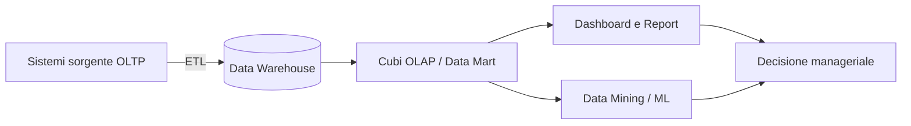

# Materia 8 — Meccanismi di Business Intelligence e Data Mining
*Materiale di studio per la prova scritta del concorso MIT-EPI (60 quesiti a risposta multipla, 70 minuti)*

---

## 1. Cos'è la Business Intelligence
La **Business Intelligence (BI)** è l'insieme di processi, tecnologie e strumenti che trasformano dati grezzi in **informazioni utili al processo decisionale**. Nella Pubblica Amministrazione supporta, tra l'altro, il monitoraggio degli investimenti pubblici, la rendicontazione dei fondi PNRR e il controllo di gestione.

Il ciclo tipico della BI è: **raccolta dati → integrazione (ETL) → archiviazione (data warehouse) → analisi → presentazione (dashboard/report) → decisione**.

## 2. OLTP vs OLAP

| Caratteristica | OLTP (Online Transaction Processing) | OLAP (Online Analytical Processing) |
|---|---|---|
| Scopo | gestione operativa quotidiana | analisi storica e supporto decisionale |
| Tipo di operazioni | INSERT/UPDATE/DELETE frequenti, piccole transazioni | SELECT complesse su grandi volumi |
| Modello dati | normalizzato (3NF) per evitare anomalie | denormalizzato (schema a stella/fiocco di neve) per velocità di lettura |
| Utenti | impiegati, applicazioni gestionali | analisti, dirigenti, data scientist |
| Esempio | sistema di protocollo, gestione pratiche | data warehouse per reportistica direzionale |
| Volumi tipici query | righe singole | milioni di righe aggregate |

*Sintesi per l'esame*: se la domanda descrive un sistema che "elabora molte piccole transazioni in tempo reale" è OLTP; se descrive "analisi aggregate su dati storici per supportare decisioni" è OLAP.

## 3. Modello dimensionale e cubi OLAP
I data warehouse orientati all'analisi tipicamente adottano uno **schema a stella (star schema)** o **a fiocco di neve (snowflake schema)**:

* **Tabella dei fatti (fact table):** contiene le misure quantitative (es. importo speso, numero di pratiche) e le chiavi esterne verso le dimensioni.
* **Tabelle delle dimensioni (dimension table):** contengono gli attributi descrittivi per l'analisi (es. tempo, territorio, tipologia di intervento). Nello star schema sono denormalizzate (una sola tabella per dimensione); nello snowflake schema sono ulteriormente normalizzate in sotto-tabelle.

Un **cubo OLAP** è la rappresentazione multidimensionale dei dati (es. assi: tempo, territorio, tipo di spesa) che permette operazioni tipiche di analisi:
* **Slice:** seleziona una singola "fetta" del cubo fissando un valore su una dimensione (es. solo l'anno 2025).
* **Dice:** seleziona un sotto-cubo filtrando su più dimensioni contemporaneamente.
* **Drill-down:** aumenta il livello di dettaglio (es. da "anno" a "mese").
* **Roll-up:** riduce il livello di dettaglio aggregando (es. da "regione" a "nazione").
* **Pivot (rotazione):** scambia gli assi di visualizzazione del cubo per osservare i dati da un'altra prospettiva.

## 4. KPI e Dashboard
* **KPI (Key Performance Indicator):** indicatore quantitativo che misura il raggiungimento di un obiettivo strategico o operativo (es. percentuale di pratiche evase entro i termini, tempo medio di risposta di un servizio digitale).
* Un buon KPI dovrebbe essere **SMART**: Specific (specifico), Measurable (misurabile), Achievable (raggiungibile), Relevant (rilevante), Time-bound (temporalmente definito).
* **Dashboard:** interfaccia visuale che aggrega KPI e metriche in tempo (quasi) reale per un rapido controllo direzionale, spesso costruita con strumenti come Power BI, Tableau, o soluzioni open source come Metabase/Grafana.

## 5. Data Mining: tecniche principali
Il **data mining** è il processo di scoperta di pattern, correlazioni e conoscenza non ovvia all'interno di grandi quantità di dati, tipicamente parte di un processo più ampio noto come **KDD (Knowledge Discovery in Databases)**.

### 5.1 Clustering (apprendimento non supervisionato)
Raggruppa oggetti simili tra loro in **cluster**, senza conoscere a priori le etichette/categorie.
* **Algoritmo tipico:** K-means (partiziona i dati in *k* gruppi minimizzando la distanza dai centroidi).
* **Esempio pratico:** segmentazione degli utenti di un servizio digitale della PA in gruppi omogenei per comportamento d'uso, per personalizzare la comunicazione o individuare esigenze comuni.

### 5.2 Association Rule Mining (regole di associazione)
Individua relazioni frequenti tra elementi in grandi insiemi di transazioni, espresse come regole "se A allora B" con misure di **supporto** (frequenza della combinazione) e **confidenza** (affidabilità della regola).
* **Algoritmo tipico:** Apriori.
* **Esempio pratico:** analisi delle richieste di accesso agli atti per individuare che chi richiede il documento X spesso richiede anche il documento Y, utile per ottimizzare i processi di erogazione dei servizi.

### 5.3 Classification (apprendimento supervisionato)
Assegna un'osservazione a una categoria predefinita, sulla base di un modello addestrato su dati etichettati.
* **Algoritmi tipici:** alberi decisionali, random forest, support vector machine (SVM), reti neurali.
* **Esempio pratico:** classificare automaticamente le istanze/pratiche in ingresso per instradarle all'ufficio competente corretto, sulla base del testo e dei metadati.

### 5.4 Anomaly Detection (rilevamento anomalie)
Identifica osservazioni che si discostano significativamente dal comportamento atteso.
* **Approcci:** statistici (deviazione standard, z-score), basati su clustering (punti lontani da ogni cluster), basati su modelli ML supervisionati o non supervisionati (isolation forest, autoencoder).
* **Esempio pratico:** rilevamento di accessi anomali a un sistema informativo (possibile intrusione) o di pattern di spesa anomali in una gara d'appalto (possibile frode/anomalia da segnalare all'audit).

## 6. Data Governance e Data Quality
* **Data Governance:** insieme di politiche, ruoli e processi che garantiscono che i dati siano gestiti in modo coerente, sicuro e conforme lungo tutto il loro ciclo di vita (chi può accedervi, chi ne è responsabile — **data owner**/**data steward** —, come vengono classificati).
* **Data Quality:** le dimensioni principali della qualità del dato sono:
  * **Accuratezza:** il dato riflette correttamente la realtà.
  * **Completezza:** assenza di valori mancanti rilevanti.
  * **Coerenza (consistency):** assenza di contraddizioni tra sistemi diversi che trattano lo stesso dato.
  * **Tempestività (timeliness):** il dato è disponibile ed aggiornato quando serve.
  * **Univocità:** assenza di duplicati.
* Una **BI/data mining efficace dipende in modo critico dalla qualità dei dati in input** ("garbage in, garbage out"): un modello statistico o di ML costruito su dati di bassa qualità produce risultati inaffidabili indipendentemente dalla sofisticazione dell'algoritmo.

*Sintesi per l'esame*: se una domanda chiede "qual è il prerequisito fondamentale per un'analisi di data mining affidabile", la risposta è la qualità/governance dei dati a monte, non la scelta dell'algoritmo.

---

## Domande di autoverifica

1. **Quale schema di data warehouse denormalizza completamente le tabelle delle dimensioni in un'unica tabella per dimensione?**
   a) **Star schema** b) Snowflake schema c) Schema relazionale 3NF d) Schema a grafo — corretto: lo star schema mantiene le dimensioni denormalizzate per massimizzare la velocità di lettura.

2. **L'operazione OLAP che aumenta il livello di dettaglio dei dati (es. da anno a mese) si chiama:**
   a) Roll-up b) **Drill-down** c) Slice d) Pivot — corretto: il drill-down naviga verso un maggiore dettaglio.

3. **Quale tecnica di data mining è più adatta a scoprire gruppi omogenei di utenti senza conoscere a priori le categorie?**
   a) Classification b) **Clustering** c) Association rule mining d) Regressione lineare supervisionata — corretto: il clustering è una tecnica non supervisionata pensata proprio per la scoperta di raggruppamenti.

4. **In un sistema di e-procurement della PA, quale tecnica di data mining è più indicata per individuare pattern di spesa anomali potenzialmente fraudolenti?**
   a) Association rule mining b) **Anomaly detection** c) Clustering k-means d) OLAP roll-up — corretto: l'anomaly detection è specificamente progettata per identificare osservazioni che si discostano dal comportamento atteso.

5. **Un sistema che gestisce migliaia di piccole transazioni di inserimento pratiche al giorno, con vincoli di integrità stringenti, è tipicamente classificato come:**
   a) **OLTP** b) OLAP c) Data lake d) Data mart analitico — corretto: elevato volume di piccole transazioni con integrità è la definizione di OLTP.

6. **Perché la data governance è considerata un prerequisito critico per la BI e il data mining?**
   a) Serve solo per la conformità legale, non per l'analisi b) **Perché la qualità dei dati in input determina l'affidabilità di qualsiasi analisi o modello successivo** c) Riguarda solo la sicurezza informatica d) È rilevante solo per i dati non strutturati — corretto: dati di bassa qualità producono risultati inaffidabili indipendentemente dalla sofisticazione degli strumenti di analisi.
