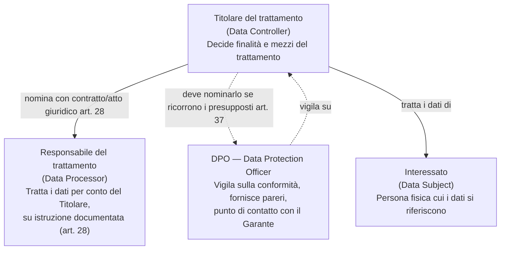
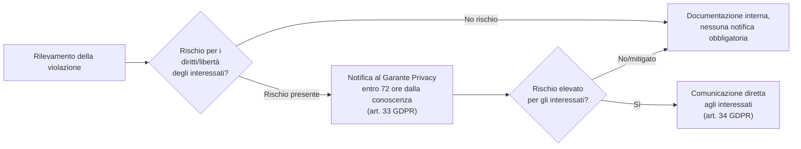

# Materia 9 — Tutela dei dati personali

Materiale di studio per la prova scritta del concorso MIT-EPI. Fonti di riferimento nel repository: `AGID/pdf/11_All_D_Modellazione_Minacce.pdf` (§5.8, dedicato interamente a Privacy by Design e GDPR), [`AGID_Sintesi_Preparazione_Concorso.md` §12](../../AGID_Sintesi_Preparazione_Concorso.md) e [`Sintesi_Firma_Digitale.md`](../../Sintesi_Firma_Digitale.md) per il collegamento con l'identità digitale.

---

## 1. Inquadramento normativo

Il **GDPR** (Regolamento UE 2016/679, in vigore dal 25 maggio 2018) è la fonte primaria europea sulla protezione dei dati personali, direttamente applicabile in tutti gli Stati membri; ha abrogato la Direttiva 95/46/CE. In Italia il **D.Lgs. 101/2018** ha adeguato il previgente Codice Privacy (D.Lgs. 196/2003) al nuovo regolamento, integrandolo anziché sostituirlo integralmente: il Codice Privacy resta in vigore per le parti compatibili con il GDPR (es. sanzioni penali, disposizioni su specifici trattamenti nazionali), mentre il GDPR prevale come disciplina generale del trattamento.

## 2. Principi fondamentali del trattamento (art. 5 GDPR)

| Principio | Significato |
|---|---|
| **Liceità, correttezza e trasparenza** | Il trattamento deve avere una base giuridica valida ed essere comprensibile per l'interessato |
| **Limitazione della finalità** | I dati vanno raccolti per scopi determinati, espliciti e legittimi, e non trattati ulteriormente in modo incompatibile con tali scopi |
| **Minimizzazione dei dati** | Si raccolgono solo i dati adeguati, pertinenti e limitati a quanto necessario rispetto alle finalità |
| **Esattezza** | I dati devono essere esatti e aggiornati |
| **Limitazione della conservazione** | I dati sono conservati solo per il tempo necessario alle finalità del trattamento |
| **Integrità e riservatezza** | Il trattamento deve garantire sicurezza adeguata (cifratura, controllo accessi) |
| **Accountability (responsabilizzazione)** | Il Titolare deve essere in grado di **dimostrare** la conformità a tutti i principi precedenti, non solo rispettarli |

L'accountability è il principio che più caratterizza il GDPR rispetto alla precedente direttiva: non basta essere conformi, occorre poterlo provare (documentazione, registri, policy, DPIA).

## 3. Basi giuridiche del trattamento (art. 6 GDPR)

Un trattamento di dati personali è lecito solo se ricade in almeno una di queste basi giuridiche:

1. **Consenso** dell'interessato, libero, specifico, informato e inequivocabile.
2. **Esecuzione di un contratto** di cui l'interessato è parte (o misure precontrattuali su sua richiesta).
3. **Obbligo legale** cui è soggetto il titolare del trattamento.
4. **Salvaguardia di interessi vitali** dell'interessato o di terzi.
5. **Esecuzione di un compito di interesse pubblico** o connesso all'esercizio di pubblici poteri — è la base giuridica tipicamente invocata dalla **Pubblica Amministrazione**, incluso il MIT, per i trattamenti connessi ai propri fini istituzionali (es. gestione di procedure concorsuali, art. 35 e 35-ter D.Lgs. 165/2001, come indicato nel bando del concorso EPI).
6. **Legittimo interesse** del titolare o di terzi, purché non prevalgano gli interessi o i diritti fondamentali dell'interessato (raramente applicabile alla PA).

*Nota per l'esame*: per i dati "particolari" (ex "sensibili": origine razziale/etnica, opinioni politiche, convinzioni religiose, dati genetici/biometrici, salute, vita sessuale) si applica l'art. 9 GDPR, che richiede condizioni più stringenti (es. consenso esplicito, motivi di interesse pubblico rilevante, necessità di accertamento/difesa di un diritto in sede giudiziaria).

## 4. Diritti dell'interessato (artt. 15-22 GDPR)

| Diritto | Contenuto |
|---|---|
| **Accesso** (art. 15) | Ottenere conferma dell'esistenza di un trattamento e accedere ai propri dati e alle informazioni sul trattamento |
| **Rettifica** (art. 16) | Ottenere la correzione di dati inesatti o l'integrazione di dati incompleti |
| **Cancellazione / "diritto all'oblio"** (art. 17) | Ottenere la cancellazione dei propri dati quando non più necessari, in caso di revoca del consenso, trattamento illecito, ecc. — non è un diritto assoluto: cede, ad esempio, di fronte a obblighi legali di conservazione |
| **Limitazione di trattamento** (art. 18) | Ottenere la sospensione del trattamento (non la cancellazione) in specifiche circostanze (es. contestazione dell'esattezza dei dati) |
| **Portabilità dei dati** (art. 20) | Ricevere i propri dati in un formato strutturato, di uso comune e leggibile da dispositivo automatico, e trasmetterli a un altro titolare — si applica solo ai trattamenti basati su consenso o contratto ed effettuati con mezzi automatizzati |
| **Opposizione** (art. 21) | Opporsi in qualsiasi momento al trattamento basato su legittimo interesse o interesse pubblico, per motivi legati alla propria situazione particolare |
| **Non essere sottoposto a decisioni basate unicamente su trattamento automatizzato** (art. 22) | Include la profilazione, salvo eccezioni (consenso esplicito, necessità contrattuale, autorizzazione di legge con garanzie adeguate) |

## 5. Ruoli e responsabilità

- **Titolare del trattamento**: la persona fisica/giuridica/PA che determina finalità e mezzi del trattamento; risponde in prima persona della conformità.
- **Responsabile del trattamento**: soggetto terzo che tratta dati per conto del Titolare, sulla base di un atto giuridico (contratto o altro atto) che ne disciplina oggetto, durata, natura e finalità del trattamento, obblighi e diritti del Titolare (art. 28 GDPR) — tipicamente un fornitore di servizi IT/cloud.
- **DPO (Data Protection Officer)**: obbligatorio per le **autorità pubbliche** (indipendentemente dalla natura dei dati trattati), oltre che per soggetti privati il cui core business comporti monitoraggio sistematico su larga scala o trattamento su larga scala di categorie particolari di dati. Il DPO non è responsabile in prima persona della conformità (resta il Titolare), ma vigila, informa, forma e fa da interfaccia con l'Autorità Garante.

## 6. Data Protection Impact Assessment (DPIA)

La **DPIA** (Valutazione d'Impatto sulla Protezione dei Dati, art. 35 GDPR) è una valutazione preventiva obbligatoria quando un trattamento, per la sua natura, ambito, contesto e finalità, **presenta un rischio elevato** per i diritti e le libertà delle persone fisiche.

**Casi in cui è obbligatoria** (esemplificativi, art. 35.3 e linee guida EDPB):
- Valutazione sistematica e globale di aspetti personali basata su trattamenti automatizzati, incluse le decisioni con effetti giuridici (es. profilazione).
- Trattamento su larga scala di categorie particolari di dati (es. dati sanitari, biometrici).
- Sorveglianza sistematica su larga scala di una zona accessibile al pubblico (es. videosorveglianza diffusa).
- Uso di nuove tecnologie con impatto significativo sulla privacy (es. IoT su larga scala, IA per decisioni automatizzate).

**Contenuto minimo di una DPIA**: descrizione sistematica del trattamento e delle finalità; valutazione di necessità e proporzionalità; valutazione dei rischi per i diritti e le libertà degli interessati; misure previste per affrontare i rischi (garanzie, misure di sicurezza, meccanismi per dimostrare la conformità). Il **DPO** deve essere consultato nella stesura della DPIA quando nominato.

## 7. Data Breach: gestione e obblighi di notifica

Un **data breach** (violazione di dati personali) è una violazione di sicurezza che comporta, accidentalmente o in modo illecito, la distruzione, perdita, modifica, divulgazione non autorizzata o accesso ai dati personali.

- **Notifica al Garante**: entro **72 ore** dal momento in cui il Titolare ne viene a conoscenza, salvo che sia improbabile che la violazione presenti un rischio per i diritti e le libertà delle persone. Se la notifica avviene oltre le 72 ore, va motivato il ritardo.
- **Comunicazione agli interessati**: dovuta senza ingiustificato ritardo quando la violazione è suscettibile di presentare un **rischio elevato**, salvo che il Titolare abbia già adottato misure che rendono i dati incomprensibili (es. cifratura efficace) o abbia adottato misure successive che escludono il concretizzarsi del rischio elevato.
- **Doppio binario NIS2/GDPR**: nel caso di un attacco (es. ransomware) che comprometta sia la sicurezza di un servizio essenziale sia dati personali, la PA deve notificare **sia** il CSIRT Italia/ACN (obbligo NIS2, entro 24h per il preallarme) **sia** il Garante Privacy (obbligo GDPR, entro 72h) — vedi [`AGID_Sintesi_Preparazione_Concorso.md` §9](../../AGID_Sintesi_Preparazione_Concorso.md).

## 8. Privacy by Design e by Default (art. 25 GDPR)

L'art. 25 GDPR impone al Titolare di mettere in atto misure tecniche e organizzative adeguate:

- **Privacy by Design** ("by design"): la protezione dei dati va integrata **fin dalla progettazione** del sistema/processo, non aggiunta a posteriori. Tecniche tipiche: pseudonimizzazione, minimizzazione dei dati raccolti, cifratura at-rest/in-transit.
- **Privacy by Default** ("by default"): le impostazioni predefinite di un sistema devono essere le **più restrittive possibile** in termini di dati raccolti, portata del trattamento, periodo di conservazione e accessibilità — l'utente non deve dover agire attivamente per proteggere la propria privacy.

Questi principi sono il pilastro su cui si fonda il framework "Secure/Privacy by Design" di AGID (§5.8 delle Linee Guida sulla Modellazione delle Minacce), che a sua volta integra i sette principi enunciati da Ann Cavoukian (proattivo non reattivo, privacy come default, privacy incorporata nel design, funzionalità piena, sicurezza end-to-end, visibilità e trasparenza, rispetto della privacy dell'utente).

### 8.1 Requisiti di sicurezza applicativa nel GDPR (art. 32)
L'art. 32 GDPR ("Sicurezza del trattamento") richiede misure tecniche e organizzative adeguate al rischio, tra cui:
- **Pseudonimizzazione e cifratura** dei dati personali.
- Capacità di assicurare in modo permanente **riservatezza, integrità, disponibilità e resilienza** dei sistemi e servizi di trattamento (i tre pilastri CIA, vedi [Materia 7](07_cybersecurity_crittografia.md)).
- Capacità di **ripristinare tempestivamente** la disponibilità e l'accesso ai dati in caso di incidente fisico o tecnico.
- Una procedura per **testare, verificare e valutare regolarmente** l'efficacia delle misure di sicurezza (es. penetration test periodici).

## 9. Rapporto con il Codice Privacy italiano (D.Lgs. 196/2003 e succ. mod.)

Il **Codice Privacy** (D.Lgs. 196/2003), come riformato dal D.Lgs. 101/2018, resta in vigore per:
- Le disposizioni relative alle **sanzioni penali** in materia di trattamento illecito di dati.
- La disciplina di **specifici settori** non armonizzati a livello UE (es. trattamenti per finalità giornalistiche, trattamenti in ambito giudiziario/di polizia).
- L'individuazione dell'**Autorità Garante per la protezione dei dati personali** come autorità di controllo nazionale competente ad applicare il GDPR in Italia, con poteri di indagine, correttivi (incluse sanzioni amministrative fino a 20 milioni di euro o il 4% del fatturato globale) e consultivi.

Per il resto, il GDPR è **direttamente applicabile** senza necessità di recepimento, e prevale sulle norme nazionali con esso incompatibili.

## Domande di autoverifica

1. Quale principio del GDPR impone al Titolare non solo di rispettare le regole ma di poterlo dimostrare attivamente?
   a) Minimizzazione dei dati
   b) Accountability (responsabilizzazione)
   c) Limitazione della finalità
   d) Esattezza
   **Risposta: b)** — l'accountability richiede la capacità di dimostrare la conformità, tramite documentazione, registri e policy.

2. Qual è la base giuridica tipicamente invocata da una Pubblica Amministrazione per i trattamenti connessi ai propri fini istituzionali, come la gestione di un concorso pubblico?
   a) Consenso dell'interessato
   b) Legittimo interesse
   c) Esecuzione di un compito di interesse pubblico
   d) Interessi vitali dell'interessato
   **Risposta: c)** — l'art. 6.1.e GDPR è la base giuridica standard per i trattamenti della PA nell'esercizio di pubblici poteri.

3. Entro quante ore dalla conoscenza di una violazione di dati personali con rischio per gli interessati va effettuata la notifica al Garante Privacy?
   a) 24 ore
   b) 48 ore
   c) 72 ore
   d) 7 giorni
   **Risposta: c)** — art. 33 GDPR, salvo motivato ritardo.

4. In quale dei seguenti casi la DPIA è tipicamente obbligatoria?
   a) Gestione di un semplice indirizzario email interno aziendale
   b) Sorveglianza sistematica su larga scala di una zona accessibile al pubblico
   c) Archiviazione cartacea di pochi documenti amministrativi
   d) Invio di una newsletter a iscritti che hanno dato consenso esplicito
   **Risposta: b)** — rientra tra i casi ad alto rischio individuati dall'art. 35.3 GDPR e dalle linee guida EDPB.

5. Che differenza c'è tra Titolare e Responsabile del trattamento?
   a) Sono sinonimi secondo il GDPR
   b) Il Titolare determina finalità e mezzi del trattamento, il Responsabile tratta i dati per suo conto sulla base di un atto giuridico
   c) Il Responsabile determina sempre le finalità del trattamento
   d) Solo il Responsabile può essere sanzionato dal Garante
   **Risposta: b)** — art. 4 e art. 28 GDPR.

6. "Le impostazioni predefinite di un sistema devono essere le più restrittive possibile in termini di dati raccolti" descrive il principio di:
   a) Privacy by Design
   b) Privacy by Default
   c) Data minimization contrattuale
   d) Accountability
   **Risposta: b)** — è la definizione specifica di Privacy by Default (art. 25.2 GDPR), distinta da Privacy by Design che riguarda l'integrazione della protezione dati fin dalla progettazione.
