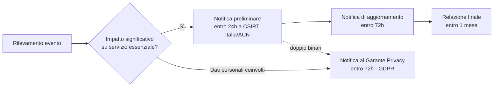

# Materia 12 — Disciplina nazionale ed europea NIS (Network and Information Security)
*Concorso MIT — Codice EPI (Specialista Informatico). Fonti: [`AGID_Sintesi_Preparazione_Concorso.md`](../../AGID_Sintesi_Preparazione_Concorso.md) §9-10, [`Sintesi_ACN_Cybersicurezza_PMI.md`](../../Sintesi_ACN_Cybersicurezza_PMI.md), [`Guida Tecnica ai Framework di Governance IA e Resilienza Digitale UE.md`](../../Guida%20Tecnica%20ai%20Framework%20di%20Governance%20IA%20e%20Resilienza%20Digitale%20UE.md) §5, `fonti_banca_italia/Regolamento DORA, LOTL e Threat Shifting - Implicazioni per la Cyber Security.pdf`, `fonti_banca_italia/Guida_nazionale_TIBER-IT_v2.pdf`*

---

## 1. Dalla Direttiva NIS alla NIS2: evoluzione normativa

| | NIS1 | NIS2 |
|---|---|---|
| Norma UE | Direttiva UE 2016/1148 | Direttiva UE 2022/2555 |
| Recepimento italiano | D.Lgs. 65/2018 | D.Lgs. 138/2024 |
| Perimetro soggettivo | Operatori di Servizi Essenziali (OSE) e Fornitori di Servizi Digitali (FSD), individuati caso per caso | Categorie predefinite per settore e dimensione ("**Soggetti Essenziali**" e "**Soggetti Importanti**"), applicazione capillare basata su soglie dimensionali (medie/grandi imprese negli Allegati I-II) |
| Ampiezza settoriale | Energia, trasporti, banche, infrastrutture mercati finanziari, sanità, acqua potabile, infrastrutture digitali | Ampliata a: PA centrali e locali, gestione rifiuti, produzione/lavorazione alimentare, manifattura di dispositivi critici, servizi postali, spazio, fornitori digitali (cloud, data center, CDN) |
| Governance/responsabilità | Debole enforcement, sanzioni disomogenee tra Stati membri | **Responsabilità personale del management** (art. 20 NIS2) per negligenza grave nella supervisione della cybersicurezza; sanzioni armonizzate e più severe |
| Incident reporting | Non armonizzato, tempistiche variabili | **Notifica precoce entro 24h**, notifica completa entro 72h, relazione finale entro un mese |

*Sintesi per l'esame*: la NIS2 non è un semplice aggiornamento tecnico della NIS1, ma un cambio di paradigma — passa da un perimetro discrezionale (caso per caso) a un perimetro **automatico per categoria/dimensione**, e sposta l'accountability dal solo reparto IT al **vertice aziendale**.

---

## 2. Ampliamento del perimetro: soggetti essenziali e importanti

* **Soggetti Essenziali**: settori ad altissima criticità (energia, trasporti, sanità, acqua, infrastrutture digitali, PA centrale, spazio) — soggetti a vigilanza **ex ante** (controlli proattivi anche in assenza di incidenti).
* **Soggetti Importanti**: settori comunque rilevanti ma a criticità minore (servizi postali, gestione rifiuti, manifattura, fornitori digitali di dimensioni inferiori) — soggetti a vigilanza **ex post** (controlli attivati prevalentemente a seguito di incidenti o segnalazioni).
* **Criterio dimensionale**: si applica generalmente a **medie e grandi imprese** (≥50 dipendenti o ≥10 milioni di fatturato) operanti nei settori degli Allegati I e II della direttiva, salvo eccezioni per soggetti critici indipendentemente dalla dimensione.
* **Supply chain**: gli obblighi NIS2 si estendono, per trascinamento contrattuale, anche ai fornitori di soggetti essenziali/importanti — una PMI fornitrice di un ente NIS2 deve garantire risk assessment, continuità operativa, integrità del software e disponibilità all'audit, anche se non rientra direttamente nel perimetro dimensionale.

---

## 3. Obblighi di incident reporting

* **CSIRT Italia** (incardinato presso **ACN**): punto di contatto nazionale unico per la notifica degli incidenti NIS2.
* **Tempistiche a tre fasi**: notifica preliminare/early warning entro **24 ore** dalla conoscenza dell'incidente → notifica di aggiornamento entro **72 ore** → relazione finale entro **un mese**.
* **Doppio binario in caso di data breach**: se l'incidente cyber comporta anche un impatto su dati personali (es. ransomware con esfiltrazione dati), la PA/impresa deve notificare **sia** l'ACN/CSIRT Italia (obbligo NIS2, per l'impatto sul servizio) **sia** il **Garante Privacy** entro 72 ore (obbligo GDPR, art. 33). Sono due obblighi paralleli e indipendenti, non alternativi.

---

## 4. Supply chain security e misure tecniche minime

* **Supply Chain Security (art. 21 NIS2)**: i soggetti in perimetro devono includere requisiti di sicurezza rigorosi nei contratti con i fornitori ICT, valutando il rischio dell'intera catena di approvvigionamento (non solo il fornitore diretto, ma anche i sub-fornitori critici).
* **Misure tecniche minime richieste**:
  * **MFA (Multi-Factor Authentication)** per l'accesso a sistemi critici e credenziali privilegiate.
  * **Cifratura** end-to-end dei dati, a riposo (at-rest) e in transito (in-transit).
  * **Backup immutabili**, testati periodicamente con ripristino completo — misura chiave contro il ransomware.
  * **Zero Trust**: nessuna fiducia implicita basata sulla sola posizione di rete; ogni accesso va verificato in base a identità, dispositivo e contesto.
  * **Privilegio minimo / RBAC / separation of duties**: nessun utente generico deve avere diritti amministrativi; account privilegiati de-privilegiati per l'uso quotidiano, con procedura eccezionale tracciata ("Break the Glass").
  * **Analisi del rischio e monitoraggio continuo**, tipicamente tramite **SIEM**, con inventario degli asset critici come prerequisito.
* **Modello di gestione incidenti a 5 fasi** (coerente con NIST/ISO 27035): (1) Pianificazione → (2) Identificazione dell'evento → (3) Gestione (rilevamento/contenimento/eliminazione-recovery) → (4) Notifica (autorità competenti) → (5) Miglioramento continuo.

---

## 5. NIS2 e PSNC (Perimetro di Sicurezza Nazionale Cibernetica)

* **PSNC** (D.Lgs. 105/2019, conv. L. 133/2019): normativa italiana **preesistente e complementare** alla NIS2, riservata alle infrastrutture **iper-critiche** dello Stato (i cosiddetti "beni ICT" di rilevanza strategica per la sicurezza nazionale).
* **Obblighi specifici PSNC**: analisi del rischio **annuale** sui beni ICT strategici, notifica degli incidenti al **CSIRT**, comunicazione al **CVCN** (Centro di Valutazione e Certificazione Nazionale) per gli acquisti di beni/servizi ICT critici destinati a infrastrutture del perimetro (DPCM 15/6/2021).
* **Rapporto con NIS2**: il PSNC non è sostituito dalla NIS2, ma la **affianca** con un livello di controllo più stringente riservato ai soggetti più critici; un ente può ricadere contemporaneamente nel perimetro NIS2 (per il proprio settore) e nel PSNC (se gestisce beni ICT di rilevanza strategica nazionale) — in tal caso si applicano cumulativamente entrambi i set di obblighi.

*Nota rilevante per il profilo MIT*: infrastrutture di trasporto critiche (reti ferroviarie, controllo del traffico aereo, grandi dighe) sono candidate naturali sia al perimetro NIS2 (settore trasporti/energia, Allegato I) sia, per i sistemi di comando e controllo più sensibili, al PSNC.

---

## 6. NIS2 a confronto con GDPR, DORA, AI Act

| Requisito | NIS2 | GDPR | DORA | AI Act |
|---|---|---|---|---|
| Natura | Direttiva UE (recepita con D.Lgs. 138/2024) | Regolamento UE (Reg. 2016/679) | Regolamento UE | Regolamento UE |
| Ambito | Cybersicurezza per entità essenziali/importanti (multisettoriale) | Protezione dati personali (orizzontale, trasversale) | Resilienza operativa digitale, settore finanziario | Sistemi di intelligenza artificiale |
| Incident reporting | 24h (preliminare) / 72h / 1 mese | 72h al Garante (data breach) | 3 fasi: iniziale, intermedio, finale | Notifica incidenti gravi all'autorità di sorveglianza |
| Testing di resilienza | Richiesto, non specificato in dettaglio | Discrezionale | **Mandatorio** — TLPT (Threat-Led Penetration Testing) per funzioni critiche | Red-teaming avversario per modelli a rischio sistemico |
| Terzi/fornitori | Sicurezza della supply chain | Nomina di Responsabili del trattamento (art. 28) | Registro fornitori critici + exit strategy obbligatoria | Verifica evidenze di conformità downstream (procurement IA) |
| Responsabilità management | **Personale** per negligenza grave (art. 20) | Responsabilità del Titolare del trattamento | Responsabilità diretta del Management Body | AI Literacy del management (art. 26) |

* **Intersezioni NIS2 / AI Act**: entrambe richiedono misure di sicurezza dei sistemi (NIS2 art. 21 vs AI Act art. 15 sulla resilienza contro attacchi avversari); un incidente grave su un sistema IA può attivare **doppia notifica** (NIS2 24/72h + notifica AI Act all'autorità di sorveglianza); entrambe impongono governance rigorosa della supply chain.
* **Perché conoscere anche DORA/AI Act in un concorso non bancario**: la logica di fondo (perimetro per criticità, incident reporting a tempi stretti, responsabilità personale del vertice, supply chain security) è la stessa "architettura normativa" che si ripete in tutti questi regimi UE di resilienza digitale — utile per rispondere a quesiti comparativi.

---

## 7. Sanzioni

* **NIS2**: sanzioni amministrative pecuniarie fino a **10 milioni di euro o 2% del fatturato globale annuo** (soggetti essenziali) — regime armonizzato a livello UE, a differenza della frammentazione sanzionatoria della NIS1.
* **Responsabilità personale (art. 20 NIS2)**: i membri dell'organo di gestione possono essere ritenuti personalmente responsabili per negligenza grave nella supervisione della cybersicurezza — incluse, nei casi più gravi, misure di sospensione temporanea dall'incarico dirigenziale.
* Le sanzioni si affiancano (non sostituiscono) a quelle già previste da GDPR in caso di data breach con impatto sui dati personali (fino al 4% del fatturato globale o 20 milioni di euro).

---

## Domande di autoverifica

1. Cosa distingue principalmente il perimetro applicativo della NIS2 rispetto alla NIS1?
   a) La NIS2 si applica solo alle banche
   b) La NIS2 individua i soggetti in perimetro per categoria settoriale e soglia dimensionale, non più caso per caso
   c) La NIS2 ha abolito ogni obbligo di notifica degli incidenti
   d) La NIS2 riguarda solo il settore pubblico
   **Risposta: b)** — è il cambio di paradigma centrale rispetto al modello discrezionale OSE/FSD della NIS1.

2. In caso di ransomware con esfiltrazione di dati personali su un ente in perimetro NIS2, quali notifiche sono dovute?
   a) Solo al Garante Privacy
   b) Solo al CSIRT Italia/ACN
   c) Sia al CSIRT Italia/ACN (NIS2) sia al Garante Privacy (GDPR) — doppio binario
   d) Nessuna notifica è obbligatoria se il ransomware viene neutralizzato in tempo
   **Risposta: c)** — i due obblighi sono paralleli e indipendenti.

3. Quali sono le tempistiche di notifica NIS2 per un incidente significativo?
   a) 24h notifica preliminare, 72h aggiornamento, 1 mese relazione finale
   b) Un'unica notifica entro 30 giorni
   c) 72h per tutte le fasi, senza distinzione
   d) Nessun termine specifico, "quanto prima possibile"
   **Risposta: a)** — schema a tre tempi definito dalla NIS2.

4. Il PSNC (Perimetro di Sicurezza Nazionale Cibernetica) rispetto alla NIS2:
   a) È stato abrogato e sostituito integralmente dalla NIS2
   b) È una normativa complementare, riservata ai beni ICT di rilevanza strategica nazionale, che può applicarsi cumulativamente alla NIS2
   c) Si applica solo alle aziende private, mai alla PA
   d) Riguarda esclusivamente la protezione dei dati personali
   **Risposta: b)** — coesistono; un ente può rientrare in entrambi i perimetri.

5. Quale misura tecnica minima è specificamente indicata come "cruciale contro il ransomware"?
   a) Firewall perimetrale da solo
   b) Backup immutabili, testati periodicamente con ripristino completo
   c) Solo l'antivirus aggiornato
   d) La sola cifratura in transito
   **Risposta: b)** — i backup immutabili e testati sono la contromisura di recovery specifica citata contro il ransomware.

6. Rispetto a DORA, in cosa la NIS2 è meno prescrittiva sul tema "testing di resilienza"?
   a) La NIS2 richiede test di resilienza ma senza specificare un metodo obbligatorio come il TLPT di DORA
   b) La NIS2 vieta esplicitamente i penetration test
   c) Sono identiche su questo punto
   d) La NIS2 non menziona affatto la resilienza
   **Risposta: a)** — DORA rende il TLPT mandatorio per le funzioni critiche del settore finanziario; la NIS2 richiede testing ma senza uno standard così specifico e vincolante.
