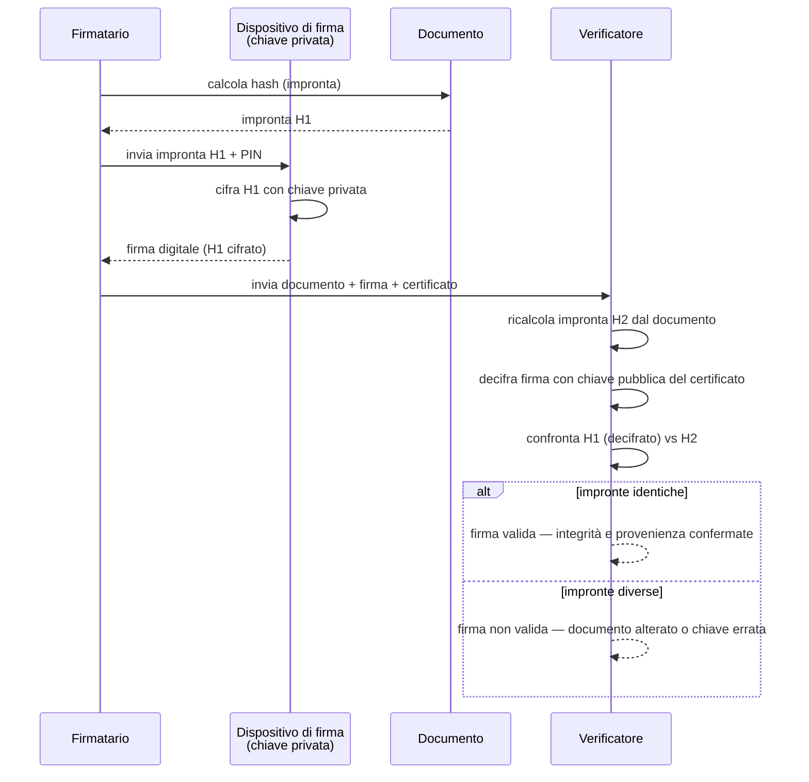

# Sintesi: Firma Digitale — Normativa, Funzionamento, Ottenimento

Questo documento integra le sintesi già presenti nel repository (in particolare [`Sintesi_CAD_e_Appalti_ICT.md`](Sintesi_CAD_e_Appalti_ICT.md) §2, la simulazione [`AGID_Simulazione_Ramo_E.md`](AGID_Simulazione_Ramo_E.md) / [Soluzioni](AGID_Simulazione_Ramo_E_Soluzioni.md), e i richiami crittografici di [`Svolgimenti_Temi_Profilo_C.md`](Svolgimenti_Temi_Profilo_C.md)) con i contenuti dell'articolo di approfondimento:

> Agenda Digitale, *"Firma digitale: cos'è, come funziona e come ottenerla"* — <https://www.agendadigitale.eu/documenti/firma-digitale-cose-come-funziona-e-come-ottenerla/>

L'obiettivo è avere un'unica scheda di ripasso completa (normativa + tecnica + operativa) per la **Materia 12** del bando AGID-01 (Ramo E) e per i quesiti di crittografia/PKI del Profilo A/C Banca d'Italia.

---

## 1. Definizione e inquadramento normativo

**Definizione tecnica** (Agenda Digitale): la firma digitale è "il risultato di una procedura informatica basata su tecniche crittografiche che consente di associare in modo indissolubile un numero binario (la firma) a un documento informatico", garantendo **autenticità, integrità, non ripudio e validità legale**.

### Fonti normative — livello europeo e nazionale

| Livello | Norma | Contenuto |
|---|---|---|
| UE | **Regolamento eIDAS (Reg. UE 910/2014)**, operativo dal 1° luglio 2016 | Sostituisce la precedente Direttiva 1999/93/EC; definisce i tre livelli di firma elettronica (FES/FEA/FEQ) e i servizi fiduciari; garantisce il riconoscimento reciproco tra Stati membri |
| Italia | **CAD — D.Lgs. 82/2005** (versione vigente dal 27/1/2018) | Recepisce eIDAS a livello nazionale; disciplina documento informatico, firme, domicilio digitale ([§2 di `Sintesi_CAD_e_Appalti_ICT.md`](Sintesi_CAD_e_Appalti_ICT.md)) |
| Italia | **Codice Civile, art. 2702** | Attribuisce alla scrittura privata sottoscritta con FEQ/firma digitale la **piena efficacia probatoria** |
| Italia | **Linee Guida AgID sui servizi fiduciari** ([`AGID/Pubblicazioni_e_Linee_Guida_AGID.md` §12](AGID/Pubblicazioni_e_Linee_Guida_AGID.md)) | Regole tecniche attuative su firme e sigilli elettronici qualificati, sottoscrizione elettronica dei documenti (art. 20 CAD) |

> **Nota di metodo**: il CAD non è un corpo normativo isolato — attua a livello nazionale il regolamento eIDAS, così come attua digitalmente gli istituti della L. 241/1990 (v. Quesito 5 di [`AGID_Simulazione_Ramo_E_Soluzioni.md`](AGID_Simulazione_Ramo_E_Soluzioni.md)).

---

## 2. Le tre firme elettroniche (FES / FEA / FEQ) e la Firma Digitale

Tabella integrata: definizione giuridica (repo, coerente con eIDAS/CAD) + precisazioni operative dell'articolo. Coerentemente con il modello a **tre livelli** già usato in [`Sintesi_CAD_e_Appalti_ICT.md`](Sintesi_CAD_e_Appalti_ICT.md) §2 e in `Mappa_Mentale_AGID.html` (Mat. 12), FEQ e Firma Digitale sono trattate come lo **stesso livello**: la "Firma Digitale" è la species tecnica italiana con cui il CAD attua la FEQ prevista da eIDAS, non un quarto livello a sé stante.

| Tipo | Definizione | Requisiti | Valore probatorio |
|---|---|---|---|
| **FES** — Firma Elettronica Semplice | Dati elettronici allegati/connessi ad altri dati, usati come metodo di identificazione (es. PIN, username/password, checkbox, firma scansionata) | Nessun requisito particolare di identificazione del firmatario | Liberamente valutabile dal giudice in base a qualità, sicurezza e integrità (valore probatorio più debole) |
| **FEA** — Firma Elettronica Avanzata | Connessa unicamente al firmatario, creata con mezzi sotto il suo controllo esclusivo, in grado di rilevare modifiche successive al documento (es. firma grafometrica su tablet) | Identificazione univoca del firmatario + integrità del documento, ma **senza** certificato qualificato | In Italia, se rispetta requisiti tecnici specifici (AgID), può produrre gli stessi effetti probatori della FEQ; altrimenti resta liberamente valutabile ma con presunzione più forte della FES |
| **FEQ / Firma Digitale** — Firma Elettronica Qualificata | FEA basata su un **certificato qualificato** rilasciato da un prestatore di servizi fiduciari accreditato e creata con un **dispositivo sicuro** di firma; in Italia la "Firma Digitale" è la sua declinazione tecnica basata su crittografia asimmetrica (coppia di chiavi pubblica/privata) | Certificato qualificato + dispositivo sicuro (smart card, token, HSM in remoto) | **Piena efficacia probatoria**, equivalente alla firma autografa (art. 2702 c.c.) |

**Quando è obbligatoria la FEQ** (da [`AGID_Simulazione_Ramo_E_Soluzioni.md`](AGID_Simulazione_Ramo_E_Soluzioni.md), Quesito 1): quando l'atto produce effetti giuridici pieni e richiede valore probatorio pieno e non ripudio — tipicamente sottoscrizione di **contratti pubblici** e **provvedimenti amministrativi formali**. Per istanze informali o a basso impatto può bastare una FEA o una semplice identificazione via SPID/CIE con FES.

---

## 3. Funzionamento tecnico

### 3.1 Principio crittografico

La firma digitale si fonda sulla **crittografia asimmetrica** (coppia chiave pubblica/chiave privata) combinata con una **funzione di hash**, lo stesso schema descritto nel Tema 3.2(b) di [`Svolgimenti_Temi_Profilo_C.md`](Svolgimenti_Temi_Profilo_C.md): *"la firma digitale si ottiene cifrando l'hash del messaggio con la chiave privata del firmatario: chiunque, con la chiave pubblica, può verificarla, ottenendo integrità, autenticità e non ripudio"*.

**Fase di firma:**
1. Il software calcola l'**impronta** (hash) del documento — a ogni documento diverso corrisponde un'impronta diversa.
2. L'impronta viene inviata al **dispositivo di firma** (ambiente sicuro dove risiede la chiave privata).
3. Il titolare attiva il dispositivo tramite **PIN**.
4. La chiave privata cifra l'impronta → il risultato è la firma digitale, allegata al documento.

**Fase di verifica:**
1. Il destinatario estrae la **chiave pubblica** dal certificato del firmatario.
2. Separa documento e firma.
3. Ricalcola l'impronta del documento ricevuto.
4. Decifra la firma con la chiave pubblica, ottenendo l'impronta originale.
5. Confronta le due impronte: se identiche, la firma è valida (integrità + provenienza confermate).

### 3.2 Componenti essenziali

| Componente | Ruolo | Collegamento nel repo |
|---|---|---|
| **Hash crittografico** | Genera l'impronta univoca del documento | SHA-256 in [`Svolgimenti_Temi_Profilo_C.md`](Svolgimenti_Temi_Profilo_C.md) §3.2(a) |
| **Certificato digitale (X.509)** | Associa la chiave pubblica all'identità del firmatario | X.509/PKI in [`Svolgimenti_Temi_Profilo_C.md`](Svolgimenti_Temi_Profilo_C.md) §3.2(b) e [`Temi_Prova_Scritta_Profilo_A.md:104`](Temi_Prova_Scritta_Profilo_A.md) |
| **PKI (Public Key Infrastructure)** | Tecnologie/processi/attori che gestiscono emissione, distribuzione e revoca dei certificati (CA, CRL/OCSP) | Stesso riferimento — catena di certificazione fino a una radice attendibile |
| **Marca temporale** | Attesta che il documento esisteva in una data certa (estensione `.m7m`, validità 20 anni) | *Non presente nel repo prima di questa sintesi* |
| **HSM (Hardware Security Module)** | Server sicuro che custodisce la chiave privata per la firma remota | *Non presente nel repo prima di questa sintesi* |

---

## 4. Dispositivi e formati di firma *(contenuto nuovo, dall'articolo — non presente nelle sintesi precedenti)*

### 4.1 Dispositivi

| Modalità | Descrizione | Costo indicativo |
|---|---|---|
| **Smart card** | Microcircuito con chiave privata integrata, richiede lettore | — |
| **Token USB** | Chiavetta con lettore integrato | ~60-80 € + IVA |
| **Firma remota** | Chiave privata su **HSM** in un server sicuro, accesso via rete con autenticazione a due fattori (password + OTP); adatta a integrazioni cloud/applicative e firme massive | ~25-30 € + IVA (abbonamento) |
| **Firma "one-shot"** | Firma singola tramite SPID, senza dispositivo dedicato | ~2,99 € |

### 4.2 Formati

| Formato | Ambito | Note |
|---|---|---|
| **PAdES** | Solo PDF | Firma integrata, visibile nei normali lettori PDF |
| **CAdES** | Qualsiasi file | Genera busta crittografica `.p7m`, richiede software di verifica dedicato |
| **XAdES** | File XML | Ricco di metadati, tipico per firme automatiche/massive |
| **ASiC** | Contenitore multi-file | Zip che raggruppa file, firme e marche temporali |

Tutti i formati hanno pari validità legale sia in modalità locale sia remota.

---

## 5. Come si ottiene *(contenuto nuovo, dall'articolo)*

1. Rivolgersi a un **prestatore di servizi fiduciari qualificato**, vigilato dall'**AgID** (in Italia sono attualmente autorizzati **18 soggetti certificatori** — coerente con il ruolo AgID come "braccio tecnico-operativo" descritto in [`AGID_Sintesi_Preparazione_Concorso.md` §7](AGID_Sintesi_Preparazione_Concorso.md)).
2. **Identificazione**: di persona con documento d'identità, oppure da remoto tramite **SPID** o **CIE** (coerente con il ruolo di SPID/CIE come "unici strumenti di identificazione" nel CAD, v. [`Sintesi_CAD_e_Appalti_ICT.md` §2](Sintesi_CAD_e_Appalti_ICT.md)).
3. Costi indicativi: firma remota ~25-30 €+IVA, token USB ~60-80 €+IVA, firma one-shot via SPID ~2,99 €; **gratuita** per iscritti a ordini professionali e Camere di Commercio.

> **Nota di aggiornamento**: il numero di certificatori accreditati (18) e i costi indicati sono una fotografia puntuale ripresa dall'articolo di Agenda Digitale, non un dato normativo stabile — prima dell'esame verificare l'elenco aggiornato dei prestatori di servizi fiduciari qualificati sul sito AgID, con lo stesso criterio prudenziale già adottato in [`AGID/Pubblicazioni_e_Linee_Guida_AGID.md`](AGID/Pubblicazioni_e_Linee_Guida_AGID.md) (§ Note metodologiche) per le Linee Guida riorganizzate nel 2024-2026.

---

## 6. Efficacia probatoria e limiti

- **Piena prova**: ai sensi del CAD, il documento sottoscritto con firma digitale ha "pieno valore legale, equivalente a quello di un documento cartaceo con firma autografa" e fa piena prova della provenienza delle dichiarazioni dal sottoscrittore (presunzione relativa sul legittimo utilizzo del dispositivo — art. 2702 c.c.).
- **Inversione dell'onere della prova**: chi disconosce la sottoscrizione deve dimostrarne l'illegittimo utilizzo (querela di falso, art. 214 c.p.c.).
- **Limite importante**: la sola firma digitale **non conferisce data certa**. Per l'opponibilità a terzi serve una **marca temporale** oppure l'invio tramite **PEC**.

Questo limite è coerente con quanto già segnalato in [`Sintesi_CAD_e_Appalti_ICT.md`](Sintesi_CAD_e_Appalti_ICT.md) sulla necessità di regole tecniche di conservazione documentale (metadati minimi, fascicolazione) per garantire la piena valenza giuridica nel tempo del documento informatico.

---

## 7. Ambiti di utilizzo (sintesi articolo, ricondotti al contesto concorsuale)

| Ambito | Esempio | Collegamento repo |
|---|---|---|
| **Pubblica Amministrazione** | Atti amministrativi, provvedimenti, contratti pubblici | Caso gestionale Ramo E — sottoscrizione contratto/provvedimenti con FEQ ([`AGID_Simulazione_Ramo_E_Soluzioni.md` §b](AGID_Simulazione_Ramo_E_Soluzioni.md)) |
| **Settore legale** | Processo civile/penale telematico | — |
| **Aziende** | Bilanci, contratti, dichiarazioni fiscali | Acquisizione software artt. 68-69 CAD ([`Sintesi_CAD_e_Appalti_ICT.md` §2](Sintesi_CAD_e_Appalti_ICT.md)) |
| **Settore finanziario** | Onboarding clienti, contratti di prestito | Rilevante per Profilo A/C BdI — firma digitale come primitiva di autenticità/non ripudio ([`Svolgimenti_Temi_Profilo_C.md`](Svolgimenti_Temi_Profilo_C.md)) |
| **Sanità, HR, utilities** | Consenso informato, contratti di assunzione, attivazione servizi | — |

---

## 8. Crittografia post-quantum e firma digitale

L'articolo segnala che algoritmi tradizionali come **RSA** sono vulnerabili a computer quantistici sufficientemente potenti, e che NIST/ENISA/ETSI stanno sviluppando **firme post-quantistiche** e un approccio **"crypto-agile"** (passaggio rapido tra algoritmi senza riprogettare l'infrastruttura).

Questo si collega direttamente a due punti già presenti nel repo:
- [`Svolgimenti_Temi_Profilo_A.md:107`](Svolgimenti_Temi_Profilo_A.md): **FIPS 204 — ML-DSA** (da CRYSTALS-Dilithium) come algoritmo di firma digitale post-quantum raccomandato dal NIST in sostituzione di RSA-PSS/ECDSA/EdDSA.
- [`Svolgimenti_Temi_Profilo_C.md:120,124`](Svolgimenti_Temi_Profilo_C.md): rischio "**harvest now, decrypt later**" e necessità di pianificare per tempo la transizione post-quantum, oltre a **ML-KEM** per lo scambio chiavi (AES resta robusto, solo indebolito da Grover).

> **Per l'esame**: se un quesito unisce "firma digitale" e "crittografia post-quantum", il filo conduttore è che la firma digitale poggia oggi su algoritmi asimmetrici (RSA/ECC) rotti in teoria dall'algoritmo di Shor — da qui la migrazione pianificata verso ML-DSA/ML-KEM con un approccio crypto-agile, per non dover riprogettare l'intera PKI a ogni cambio di algoritmo.

---

## 9. Collegamenti per la preparazione al concorso

| Materia/Ramo | Documento di riferimento |
|---|---|
| Materia 12 (CAD) — Ramo E | [`AGID_Simulazione_Ramo_E.md`](AGID_Simulazione_Ramo_E.md) Quesito 1 e caso gestionale (b) |
| Normativa CAD integrale | [`Sintesi_CAD_e_Appalti_ICT.md`](Sintesi_CAD_e_Appalti_ICT.md) §2 |
| Linee guida tecniche AgID sui servizi fiduciari | [`AGID/Pubblicazioni_e_Linee_Guida_AGID.md`](AGID/Pubblicazioni_e_Linee_Guida_AGID.md) §12 |
| Fondamenti crittografici (PKI, X.509, TLS) | [`Svolgimenti_Temi_Profilo_C.md`](Svolgimenti_Temi_Profilo_C.md) Tema 3.2, [`Temi_Prova_Scritta_Profilo_A.md:104`](Temi_Prova_Scritta_Profilo_A.md) |
| Crittografia post-quantum | [`Svolgimenti_Temi_Profilo_A.md:107`](Svolgimenti_Temi_Profilo_A.md) |
| eIDAS come framework normativo trasversale | [`Sintesi_Normazione_Interoperabilita.md:11,40`](Sintesi_Normazione_Interoperabilita.md), [`Sintesi_ACN_Cybersicurezza_PMI.md:76`](Sintesi_ACN_Cybersicurezza_PMI.md) |
| Metadatazione e conservazione del documento informatico | [`Sintesi_Dati_Metadatazione_ML.md:22,31`](Sintesi_Dati_Metadatazione_ML.md) |

**Fonte esterna integrata in questa sintesi**: Agenda Digitale, *"Firma digitale: cos'è, come funziona e come ottenerla"*, <https://www.agendadigitale.eu/documenti/firma-digitale-cose-come-funziona-e-come-ottenerla/> (contenuti su dispositivi di firma, formati PAdES/CAdES/XAdES/ASiC, procedura di ottenimento, costi ed elenco certificatori — non presenti nelle sintesi normative precedenti, che si concentravano sull'inquadramento giuridico FES/FEA/FEQ).
